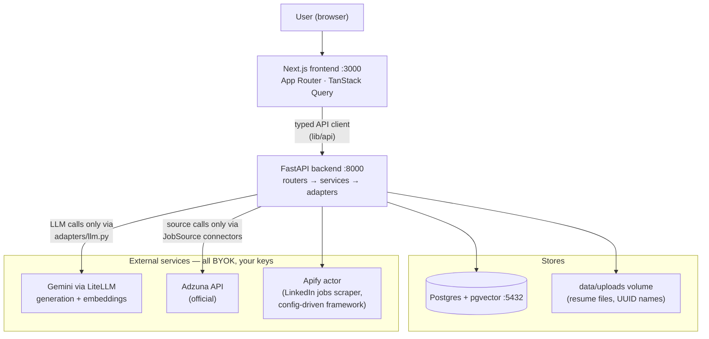
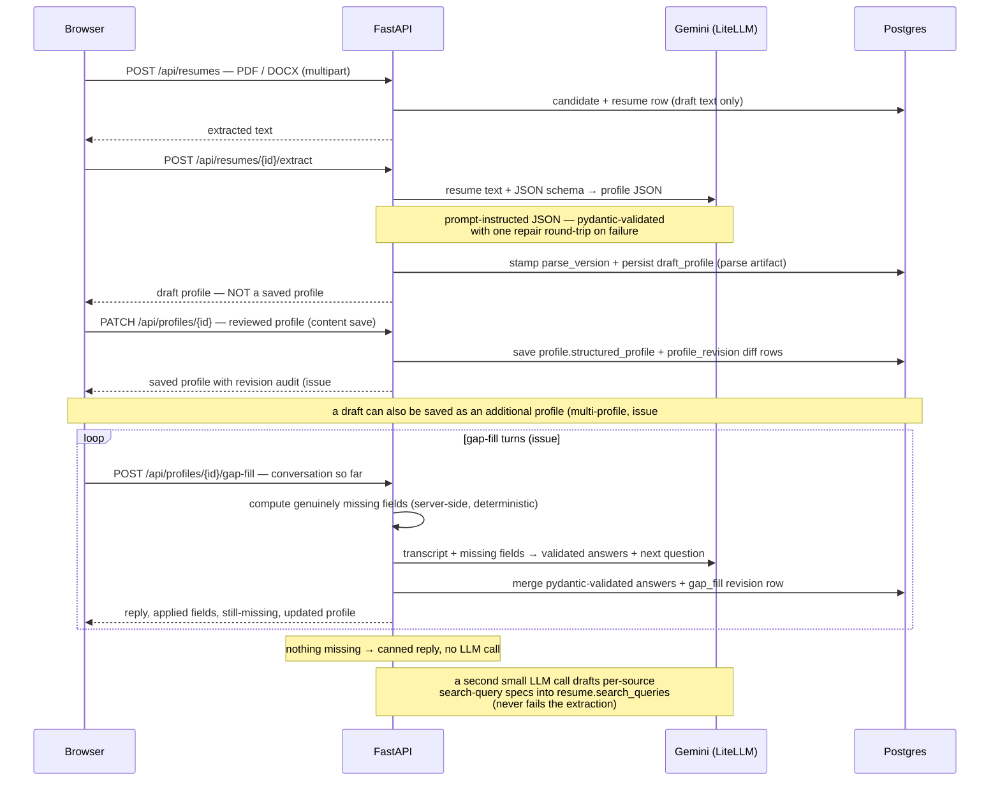
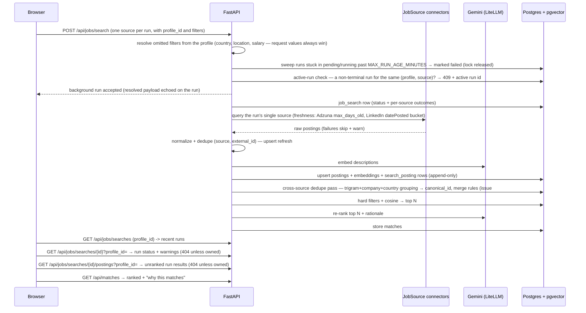

# Architecture

How AI Job Assistant fits together — components, data flows, and the database schema.
For day-to-day usage see the [user guide](guide/README.md); for scope see the
[v3 implementation plan](plans/v3/v3-implementation-plan.md) (earlier:
[v1](plans/v1/v1-implementation-plan.md), [v2](plans/v2/v2-implementation-plan.md)).

## System overview (flow diagram)

<!-- diagram: system-overview -->

Non-negotiable layering rules (enforced by the
[coding standards](instructions/)):

- `routers/` — HTTP only: parse, call a service, return a response model
- `services/` — business logic; raise domain errors
- `models/` — SQLAlchemy 2.0 ORM; the schema source of truth
- `adapters/llm.py` — the **only** place that talks to an LLM provider; it also owns
  resilience: the shared retry policy (`adapters/retry.py`, configurable via
  `LLM_RETRY_*`, default 3 attempts) applies exponential backoff with jitter on
  429/5xx/transport errors across LLM and job-source calls, honouring a provider's
  `Retry-After` hint (free-tier rate limits), plus the structured-output validation
  repair pass. Service-level errors wrap the cause hint, so the client sees
  "rate limited" / "timed out" instead of an opaque 502
- `JobSource` connector protocol — the **only** way a job source is added
- Every schema change ships as an Alembic migration in the same change
- `DbCommitMiddleware` commits each request's session **before the response reaches the
  client** — a response that returned 2xx implies durable state (fixed the upload → extract
  race where the client read a row before its transaction committed)

## Profile pipeline (sequence)

See the full walkthrough in [guide 02](guide/02-upload-and-profile.md):

<!-- diagram: profile-pipeline-sequence -->

## Search + matching (sequence)

See the full walkthrough in [guide 03](guide/03-job-discovery-and-matching.md):

<!-- diagram: search-matching-sequence -->

Search runs start **only** from an explicit `POST /api/jobs/search` — never automatically —
and are tracked in `job_search` (status + per-source `{source, status, count, warning}`
outcomes, queryable via `GET /api/jobs/searches/{id}`). A failing source is a run warning,
never an error. Background runs open fresh sessions from `session_factory` and commit
explicitly, since they outlive the request scope.

**One source per run (v3 issue #30):** `JobSearchRequest.source` is a required single
source (no more `sources` list); `source_queries` may only refine that source (mismatched
keys → 422). The UI's Start search wizard enforces the same shape. With a single source a
run is `succeeded` or `failed` — the `partial` status remains only for older stored rows.

**One active run per (profile, source) (v4 issue #36):** a partial unique index
`uq_job_search_active_run ON job_search (profile_id, source) WHERE status IN ('pending',
'running')` (enforcement survives multi-worker; `job_search.source` was backfilled from the
query echo in migration 0017) rejects a duplicate start; `start_search` returns **409
Conflict with the active run's id** (`{"detail", "active_search_id"}`), and the wizard
offers a "Go to active run" button wired into the run banner. Runs on *other* sources for
the same profile stay concurrent. Runs stuck past `MAX_RUN_AGE_MINUTES` (default 30) are
marked failed by a sweeper at the top of `start_search`, releasing the lock.

**Profile scoping (v3 issue #24):** every search is owned by a profile —
`JobSearchRequest.profile_id` is required (400 when absent, 404 for an unknown profile),
`job_search.profile_id` is NOT NULL, and both run-status/read endpoints require a
`profile_id` query param and answer 404 when it does not match the run's owner
(single-user app: state ownership, never leak across profiles). There is no
`latest_profile_id` fallback anymore. The posting↔search link lives in the append-only
`search_posting` join table (a posting re-found by a later search gains a row; nothing is
overwritten), which also replaces the mutable `job_posting.job_search_id` pointer.

**Scoped matching corpus + rebuild (v3 issue #25):** `rescore_matches` scores only the
profile's own corpus (postings joined through `search_posting → job_search.profile_id`)
— never the global postings table. Pre-scoping matches are never auto-deleted: the
explicit `POST /api/profiles/{id}/rebuild-matches` runs the scoped rescore as a
background task (status/metadata queryable via `GET`, banner shows corpus size) and
deletes that profile's out-of-corpus matches. On `/jobs` the selected profile rides in
the `?profile=` URL param and the search form refuses to submit without one.

**Read-side freshness (v3 issue #26):** matches and search results share one SQL filter —
closed postings (`is_closed`) or expired postings (`expires_at < now()`) never surface;
with no source-reported expiry a posting goes stale after `STALE_POSTING_DAYS`
(default 45) since `posted_at`. A source-reported expiry is authoritative (LinkedIn
`expireAt`); Adzuna has none, so the grace window governs. `posted_within_days` stacks on
top. The filter is read-time only — the scoring corpus and rebuild cleanup are untouched.

**Query-time freshness (v3 issue #27):** the search request accepts `max_days_old`
(1–90), rendered by `query_rendering.py` into every connector query. Adzuna sends it
directly (`max_days_old`); the LinkedIn actor input's `datePosted` resolves through the
`{date_posted_bucket}` YAML placeholder (≤1 → `past24Hours`, ≤7 → `pastWeek`, ≤30 →
`pastMonth`, else `anyTime`). Sources without a native parameter ignore it; the value is
echoed in the run's stored query.

## Source enablement (issue #8)

Sources come from a code-level registry plus **`connectors.yaml`**-configured Apify actors
(`backend/app/adapters/job_sources/connectors.yaml`) — adding an actor is a YAML entry plus
a `mappers/<source>.py` file, with no changes to matching logic. Enablement is DB-backed:

- `source_state.acknowledged_at` records the per-source disclosure acknowledgment
  (`POST /api/sources/{name}/enable` with `acknowledged_disclosure: true`; 409 without it)
- **enabled = key configured AND (official API OR disclosure acknowledged)** — checked
  against the DB at both request time and inside the background run (a failing re-check
  marks the run `failed` instead of stranding it in `running`)
- Official-API sources (Adzuna) auto-enable once their keys exist; scraping sources
  additionally require the disclosure modal

`POST /api/setup/check` reports which provider keys the backend detected plus an
embedding-capability warning, driving the `/setup` page.

## Per-source search queries

Search queries are **profile data**: a second LLM call at extraction drafts per-source
specs (`{title, skills, exclude}` per enabled source) into `resume.search_queries`; saving a
profile copies them; `POST /api/profiles/{id}/search-queries` regenerates from the current
content (temperature 0.8 + anti-repeat instruction, so Regenerate observably changes the
result). Generated specs are stamped `prompt_version` (`search_query_v3` since #31).

Since #31, generation consumes the **full profile** (skills, preferences, country,
summary — a shared digest builder also feeds the embedding, kept byte-identical) and is
cached by a content hash: `profile.queries_input_hash` = SHA-256 over the canonical
structured profile + enabled source names + filter declarations + `prompt_version`.
Automatic generation (extraction, background-refresh after a content-changing profile
save or a completed gap-fill turn) runs at temperature 0 and fires only when the stored
hash no longer matches the recomputed one; the manual regenerate endpoint always forces a
hot variant and rewrites the hash. Refresh runs happen in background tasks that open
fresh sessions — never in the request path.

Since #32, the profile carries deterministic derived experience signals: `years_of_experience`
is parsed from the verbatim experience date strings purely in Python (no LLM), and when the
user never set `preferences.seniority`, it is filled from YOE via Settings band thresholds
(`SENIORITY_BAND_*`), stamped `seniority_source: "derived"`. Derivation re-runs on every
extraction/create/save and after applied gap-fill turns; user-set values are never overwritten
and legacy provenance is treated as user-set. Both values join the shared digest builder, so
they reach the query-generation prompt and the profile embedding (old profiles re-embed
opportunistically on their next save); the rerank prompt picks them up via #37.

## Source filter capabilities (v3 issue #28)

Each `JobSource` declares its advanced filters in one schema (`SourceFilterDecl`: key,
label, type, select options, help text): Adzuna in code (`adzuna.py`), YAML-configured
actors in `connectors.yaml` (`filters:` per source). `GET /api/sources` serves the
declarations (`filters` field, alongside the legacy `supports_exclusions`), the backend
validates `source_queries[name].options` against the declaring source (unknown key /
bad type / bad enum → 400 naming the key), and connectors map validated options to
native parameters — Adzuna in `_apply_options`, YAML sources via
`{option:<key>}` placeholders in `connectors.yaml` (native types preserved; keys omitted
when unset). `query_rendering.py` stays the single render seam; a new source = a
declaration + mapper, with no changes to search logic.

Searches are **filter-first, precedence-in-rendering** (v4 issue #33): the renderer builds
a per-source **term plan** (`TermPlan`, carried on `JobSearchQuery`) whose slots are named
after Adzuna's params (`what_phrase`, `what_and`, `what_or`, `what_exclude`, `what`) plus
the LinkedIn slots (`keywords` NL brief, `date_posted` bucket). Adzuna precedence:
`what_phrase` + `what_and`/`what_or` combined; `what` only when no phrase. LinkedIn
precedence (v4 issue #35): a user-typed request `query` overrides the synthesized NL
brief `"{title} with {skills}, {seniority} level"` (seniority resolved from the
profile; no salary text); the spec's exclude terms are appended as a `not …` clause
in either case — NL is the only LinkedIn exclusion channel post-Aug-2026, and
`limitPerSource` is clamped by `MAX_APIFY_RESULTS_PER_RUN`. The
connectors act as mechanical plan→param mappers (dumb guard when a plan is empty);
connectors.yaml apify actors consume `keywords: "{keywords}"`,
`location: "{location}"`, `datePosted: "{date_posted_bucket}"` with plan-first
resolution. Unknown sources keep the plain free-text pass-through (`query`). The
normative precedence tables live in the `TermPlan`/connector docstrings and in
`services/query_rendering.py`; test_query_rendering.py locks the matrix per source.
`job_search.query` stores exactly what was sent, and the run status echoes it.
`what_and` is filled from the spec's must-have `skills_all` list (v4 issue #34).

Adzuna runs are **multi-pass within a call budget** (v4 issue #34): the connector
issues a broad pass and, when a title phrase exists and `title_only` was not
explicitly set, a `title_only` pass — deduped by `external_id` (broad pass wins)
— and paginates to page 2 only when a page fills its 50 rows and
`results_wanted` exceeds what is collected. Calls per run = Σ(sub-queries ×
pages), capped by `max_adzuna_calls_per_run` (default 4) with a stop-and-log,
never a run failure. With no salary floor set the connector also sends
`salary_include_unknown=1`.

## Database schema (v1, ER diagram)

Source of truth: `backend/app/models/` + Alembic migrations. See
[plan §4](plans/v1/v1-implementation-plan.md#4-data-model) for the data model narrative.

```mermaid
erDiagram
    candidate ||--o{ resume : "uploads"
    candidate ||--o{ profile : "tracks"
    profile ||--o{ profile_revision : "audit trail"
    profile ||--o{ match : "ranked against"
    profile ||--o{ job_search : "owns searches"
    job_search ||--o{ search_posting : "found by run"
    job_posting ||--o{ search_posting : "found in search"
    job_posting ||--o{ match : "produces"
    profile ||--o{ match_rebuild : "rebuild runs"

    candidate {
        uuid id PK
        timestamptz created_at
        timestamptz updated_at
    }

    profile {
        uuid id PK
        uuid candidate_id FK
        text name "track name, e.g. Senior Android Developer"
        jsonb structured_profile "contact, headline, skills, experience, projects, education, certifications, extra sections, embedded preferences"
        jsonb search_queries "per-source query specs + generation stamp; Regenerate overwrites"
        jsonb preferences "dashboard view preference {priority: 0-1} — role-fit vs company-fit weighting at match read time (issue #11); distinct from resume-derived prefs inside structured_profile"
        uuid source_resume_id FK "resume whose draft seeded this profile (provenance)"
        vector embedding "pgvector, dim 768 (gemini-embedding-001, truncated via dimensions param); refreshed on every content save/gap-fill"
        timestamptz created_at
        timestamptz updated_at
    }

    resume {
        uuid id PK
        uuid candidate_id FK
        text file_path "relative path under uploads_dir"
        text original_filename "metadata only, never used for storage path"
        text content_type
        integer size_bytes
        text extracted_text "stored at parse time (issue #2)"
        integer page_count "PDF only"
        timestamptz parsed_at
        text parse_version "text_v1 at upload; model+prompt version after extraction (issue #3)"
        jsonb draft_profile "AI-extracted draft — parse artifact, not a saved profile (issue #3)"
        jsonb search_queries "LLM-drafted per-source query specs (queries follow-up)"
        timestamptz created_at
    }

    profile_revision {
        uuid id PK
        uuid profile_id FK "revisions belong to a profile, not the candidate"
        text source "ai_extraction | manual_edit | gap_fill | reupload_merge"
        jsonb diff "field-level {field: {old, new}}"
        timestamptz created_at
    }

    job_search {
        uuid id PK
        uuid profile_id FK "owning profile — searches are profile-scoped (v3 #24); cascade on profile delete"
        text status "pending | running | succeeded | partial | failed"
        jsonb query "validated search request (issue #7)"
        jsonb results "per-source {source, status, count, warning?}"
        jsonb matching "per-run MatchingOutcome: status, counts, rerank token usage (issue #10)"
        timestamptz created_at
        timestamptz updated_at
    }

    search_posting {
        uuid id PK
        uuid search_id FK "run that found the posting; CASCADE"
        uuid posting_id FK "CASCADE"
        timestamptz created_at "append-only: unique (search_id, posting_id), nothing overwritten (v3 #24)"
    }

    job_posting {
        uuid id PK
        text source "adzuna | apify_linkedin | ..."
        text external_id "unique together with source — dedupe key"
        text title
        text company
        text url "posting click-through link"
        text location
        text country "run's resolved 2-letter country — dedupe grouping key (issue #38); null for pre-#38 rows"
        text job_type "native enum, nullable"
        text remote_type "native enum, nullable"
        text description
        uuid canonical_id FK "self-FK: null = own canonical; duplicates point at the canonical row (issue #38) — trigram-merged, matches collapse onto it"
        jsonb source_urls "merged record [{source, url}] of duplicates folded into this canonical row (issue #38)"
        timestamptz posted_at
        timestamptz expires_at "source-reported (LinkedIn expireAt); null when unknown"
        boolean is_closed "not null, default false; future seam — no producing source yet (v3 #26)"
        numeric salary_min
        numeric salary_max
        text currency
        jsonb raw_payload "original source data for debugging/re-mapping"
        vector embedding "pgvector, dim 768 (gemini-embedding-001, truncated via dimensions param); null when the embed call failed"
        timestamptz fetched_at
    }

    match {
        uuid id PK
        uuid profile_id FK "matching unit is the profile (owner decision 2026-09-02); CASCADE on profile or posting delete"
        uuid job_posting_id FK
        real vector_score "clamped cosine similarity (1 - distance), SQL-computed; null for un-embedded postings (issue #37 fallback)"
        real skill_score "top-skill word-boundary hit fraction over title+description, SQL (issue #37)"
        real recency_score "exp(-days_since_posting/match_recency_decay_days), 0.5 for unknown dates (issue #37)"
        real salary_score "salary-band fit: 1.0 unknown, 0.5 without a preference band (issue #37)"
        real role_fit "LLM re-rank 0-10, null when not re-ranked; stored so #11 can re-weight without an LLM call"
        real company_fit "LLM re-rank 0-10, null when not re-ranked"
        real final_score "weighted blend (vector, skill, recency, salary + LLM verdicts; issue #37) — fallback rows renormalize skill+recency+salary"
        text rationale "LLM why-this-matches, top N only; cleared when profile content changes"
        timestamptz created_at
        timestamptz updated_at
    }

    match_rebuild {
        uuid id PK
        uuid profile_id FK "CASCADE"
        text status "pending | running | succeeded | failed"
        integer corpus_count "postings found by this profile's searches (scoped corpus size)"
        integer scored_count "corpus postings that had embeddings to score"
        text warning "degraded-notice, e.g. re-rank unavailable"
        timestamptz created_at
        timestamptz updated_at
    }

    source_state {
        text source_name PK
        timestamptz acknowledged_at "disclosure acknowledgment — null until enabled (issue #8)"
    }
```

<!-- diagram: database-schema-er -->

Deferred from plan §4 (issue #4 locked decision): the separate `completeness` jsonb
column — gap-fill (#5) derives completeness from the profile instead of storing it. The
`preferences` (weights) column deferred alongside it landed with the priority slider
(issue #11): it holds the per-profile dashboard *view* weight
(`{priority: float 0–1}`, role-fit vs company-fit at match read time), distinct from the
resume-derived preferences inside `structured_profile`, and is deliberately
revision-free. Preferences extracted from the resume stay inside the profile's
`structured_profile`; the matching work (#10) reads blend weights from `Settings`
(`MATCH_WEIGHT_*` in `.env.example`) and stores the re-rank sub-scores on `match` so the
slider re-weights without an LLM call. Multi-profile moved the opposite way — from v2
into v1 (issue #6, owner decision 2026-09-01): `profile` is now the home of
`structured_profile` and the revision audit.

Schema conventions and index rules (FK columns indexed, `(source, external_id)` unique,
`match(profile_id, final_score DESC)` for the dashboard query, embedding dimension pinned
to the embedding model) live in
[instructions/database-postgres.md](instructions/database-postgres.md).

## Privacy posture

- Single implicit user, no auth — designed for localhost / your own Docker host
- BYOK: only your configured LLM and job-source providers are called, with your keys
- Resume text is stored locally (Postgres + uploads volume) and sent only to your LLM provider
- Scraping-based sources run under your own Apify account after an explicit disclosure
  acknowledgment
