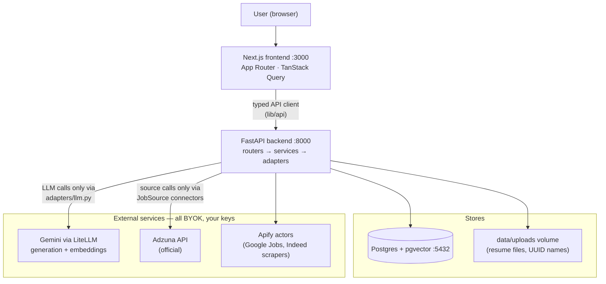
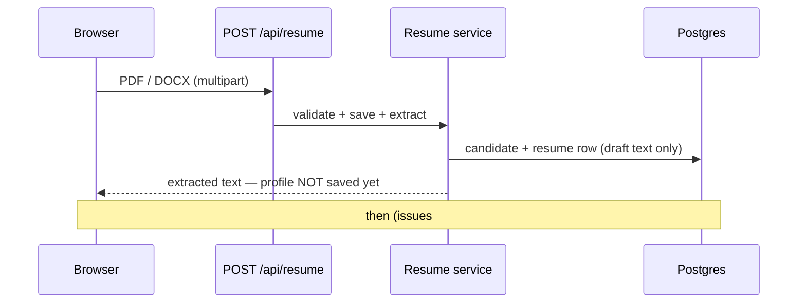
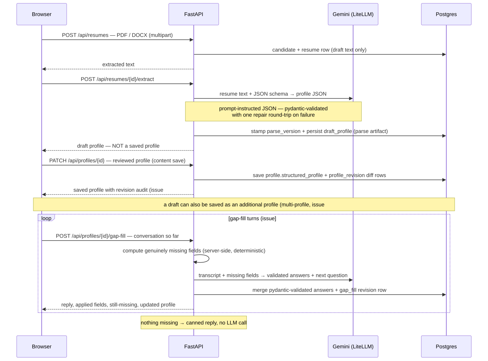
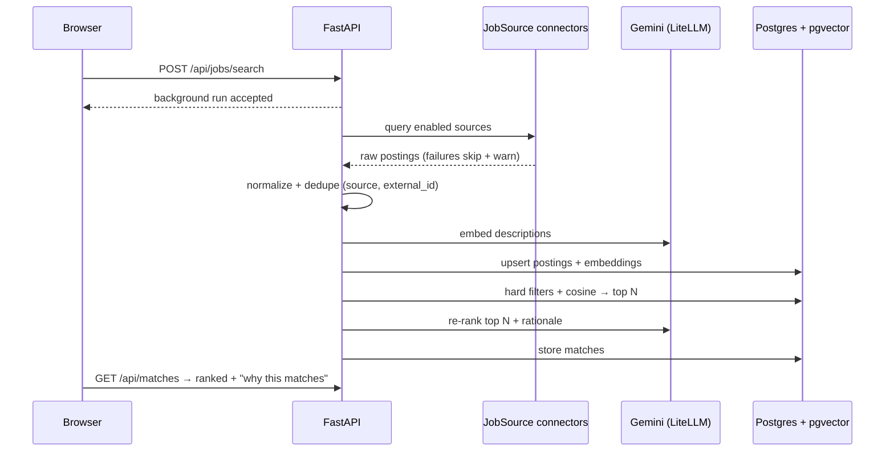
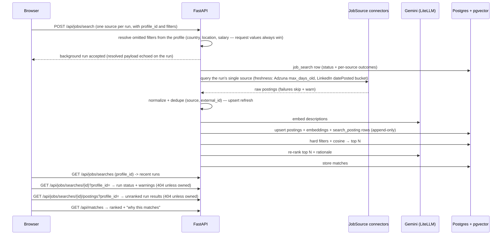
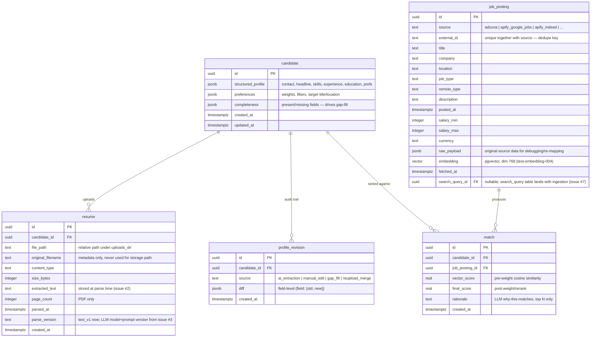

# Architecture

How AI Job Assistant fits together — components, data flows, and the database schema.
For day-to-day usage see the [user guide](guide/README.md); for scope see the
[v1 implementation plan](plans/v1-implementation-plan.md).

## System overview (flow diagram)

<!-- diagram: system-overview -->

Non-negotiable layering rules (enforced by the
[coding standards](instructions/)):

- `routers/` — HTTP only: parse, call a service, return a response model
- `services/` — business logic; raise domain errors
- `models/` — SQLAlchemy 2.0 ORM; the schema source of truth
- `adapters/llm.py` — the **only** place that talks to an LLM provider
- `JobSource` connector protocol — the **only** way a job source is added
- Every schema change ships as an Alembic migration in the same change

## Profile pipeline (sequence)

See the full walkthrough in [guide 02](guide/02-upload-and-profile.md):

<!-- diagram: profile-pipeline-sequence -->

## Search + matching (sequence)

See the full walkthrough in [guide 03](guide/03-job-discovery-and-matching.md):

<!-- diagram: search-matching-sequence -->

## Database schema (v1, ER diagram)

Source of truth: `backend/app/models/` + Alembic migrations. See
[plan §4](plans/v1-implementation-plan.md#4-data-model) for the data model narrative.

<!-- diagram: database-schema-er -->

Schema conventions and index rules (FK columns indexed, `(source, external_id)` unique,
`match(candidate_id, final_score DESC)` for the dashboard query, embedding dimension pinned
to the embedding model) live in
[instructions/database-postgres.md](instructions/database-postgres.md).

## Privacy posture

- Single implicit user, no auth — designed for localhost / your own Docker host
- BYOK: only your configured LLM and job-source providers are called, with your keys
- Resume text is stored locally (Postgres + uploads volume) and sent only to your LLM provider
- Scraping-based sources run under your own Apify account after an explicit disclosure
  acknowledgment
