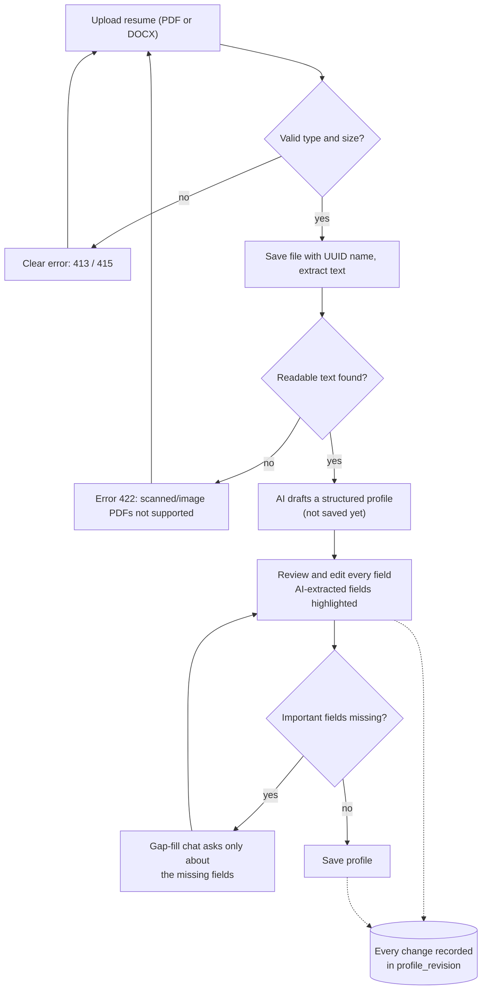
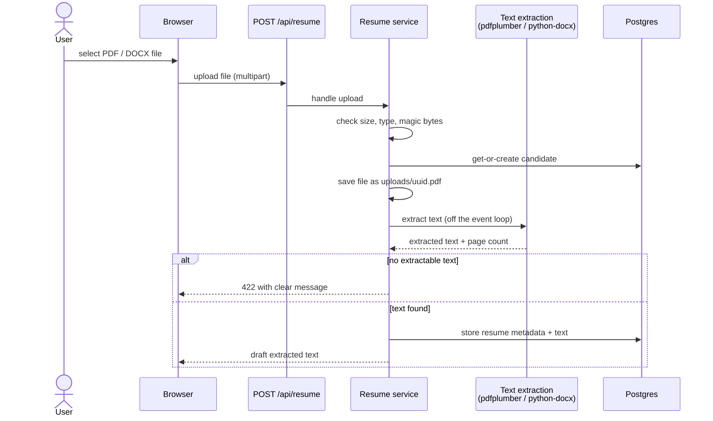

# 2 — Upload & Profile Review

**Status: planned** — resume upload + text extraction lands with
[issue #2](../plans/v1-issue-002-resume-upload.md); LLM extraction (#3), review UI (#4) and
gap-fill (#5) follow. This guide describes the finished v1 pipeline.

## The idea

You never hand-type a profile. You upload a resume, the AI turns it into a structured draft,
and **you** approve every field before it is saved. Every change — AI or human — is recorded
in an audit trail.

## The flow, end to end

<!-- diagram: profile-pipeline-flow -->

## What happens on upload (behind the scenes)

<!-- diagram: upload-sequence -->

Key guarantees baked into the design:

- **Type checking is real** — the server sniffs file magic bytes; renaming an `.exe` to
  `.pdf` gets rejected (415)
- **The file on disk is never named after your file** — it gets a UUID; your original
  filename is stored as metadata only
- **A "draft" is not a profile** — nothing from the resume is persisted as a profile until
  you review it

## Step-by-step (once the pipeline is live)

1. **Upload** — pick a standard single-column PDF or DOCX (up to 10 MB). Multi-column or
   image-only resumes parse poorly or fail with a clear message.
2. **Review the draft** — the AI-extracted profile appears as an editable form with
   AI-extracted fields highlighted. Fix anything wrong; each correction is saved to the
   `profile_revision` audit trail.
3. **Fill the gaps** — the app asks conversational questions *only* about genuinely missing
   fields (typically: target location, salary band, seniority, work authorization, remote
   preference). Answers merge into the profile, also recorded as revisions.
4. **Done** — the saved profile drives job discovery and matching. You can re-upload a newer
   resume later; changes go through a merge/diff review instead of silently overwriting.

## Privacy

- Resume content is stored only in your local Docker volumes and Postgres
- The only party that ever sees resume text (besides you) is the LLM provider **you**
  configured with **your** key

## Next

[Job discovery & matching →](03-job-discovery-and-matching.md)
