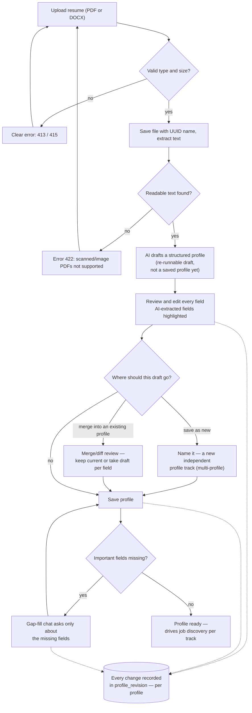
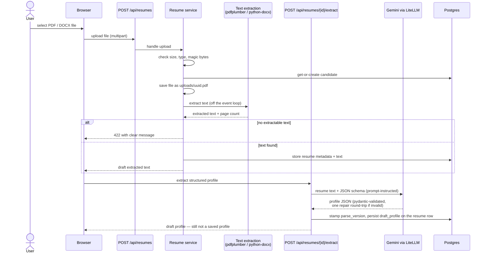
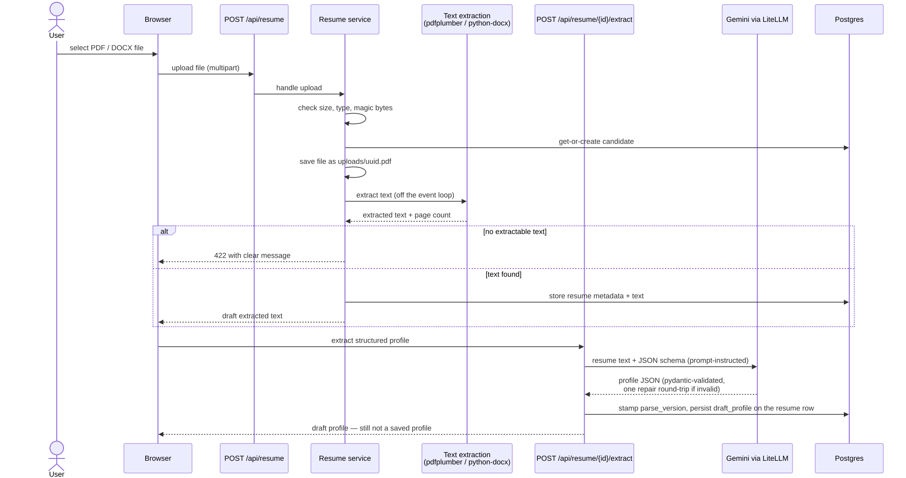

# 2 — Upload & Profile Review

**Status: shipped** — resume upload + text extraction
([issue #2](../plans/v1-issue-002-resume-upload.md)), LLM extraction to a reviewable draft
([issue #3](../plans/v1-issue-003-llm-extraction.md)), the review/edit UI with the
`profile_revision` audit trail ([issue #4](../plans/v1-issue-004-profile-persistence-review-ui.md)),
multi-profile tracks with the resume list
([issue #6](../plans/v1-issue-006-multi-profile-resume-list.md)), and conversational gap-fill
([issue #5](../plans/v1-issue-005-gap-fill.md)) are live. This guide describes the finished v1
profile pipeline.

## The idea

You never hand-type a profile. You upload a resume, the AI turns it into a structured draft,
and **you** approve every field before it is saved. Every change — AI or human — is recorded
in an audit trail.

## The flow, end to end

<!-- diagram: profile-pipeline-flow -->

## What happens on upload (behind the scenes)

<!-- diagram: upload-sequence -->

Key guarantees baked into the design:

- **Type checking is real** — the server sniffs file magic bytes; renaming an `.exe` to
  `.pdf` gets rejected (415)
- **The file on disk is never named after your file** — it gets a UUID; your original
  filename is stored as metadata only
- **A "draft" is not a profile** — the AI draft (`draft_profile`) lives on the resume row as
  a re-runnable parse artifact; nothing becomes your profile until you review and save it
- **Extraction failures never corrupt anything** — the model output is validated against a
  strict schema (with one automatic repair round-trip); a failed extraction leaves the
  resume row exactly as it was

## When things fail (and how you recover)

Nothing in the flow dead-ends — every failure has an explicit recovery path:

- **Upload rejected** (too large / wrong type / no readable text) — a specific message at
  the file input (413 / 415 / 422); just pick another file
- **Upload succeeded, extraction failed** — the form shows an **"Extract again"** action
  that re-runs extraction without re-uploading, so no duplicate resume row is created
- **Extraction interrupted** (tab closed, backend restarted) — the resume list shows an
  **"Extract profile"** action on rows without a draft, and opening a draft-less resume
  shows the same action instead of a dead retry loop
- **Provider hiccups** — transient failures (rate limit, 5xx) are retried once with a short
  backoff inside the LLM adapter; when a failure is final, the message says why
  ("rate limited by the provider — retry shortly", "request timed out", "failed validation
  after repair")
- **Invalid input** — pydantic validation errors render as readable field messages, never
  "API error 422 on …"
- **Failed saves lose nothing** — form state is preserved on save/create/rename failures;
  delete-profile failures show the reason inline with the dialog still open; a failed
  gap-fill turn puts your message back in the box; applied gap-fill answers merge into the
  editor without discarding unsaved edits
- **Backend down** — the home-page status badges re-check every 30 seconds, so a stopped
  backend becomes visible on its own; other views keep retry affordances and a global toast
  surfaces mutation failures from anywhere

## Step-by-step (once the pipeline is live)

1. **Upload** *(live)* — pick a standard single-column PDF or DOCX (up to 10 MB).
   Multi-column or image-only resumes parse poorly or fail with a clear message. The AI
   draft is generated right after upload; if it misses something, extraction can simply be
   re-run. Every upload is listed on the home page with its draft status.
2. **Review the draft** *(live)* — clicking a resume opens its AI draft as an editable form
   with AI-extracted fields highlighted. You choose the destination: merge into an existing
   profile, or save as a new one (named — e.g. "Senior Android Developer" vs "Senior
   Software Engineer"). Every correction lands in that profile's `profile_revision` trail.
3. **Fill the gaps** *(live)* — on the profile page, a short chat asks *only* about genuinely
    missing fields (typically: target location, remote preference, salary band, seniority, work
    authorization). Answers are pydantic-validated before anything is saved, each applied turn
    lands in `profile_revision` with source `gap_fill`, and the editor form stays in sync with
    what the chat saved.
4. **Done** — each profile is an independent track for job discovery and matching.
   Re-uploading a newer resume opens a merge/diff review per profile; nothing is
   overwritten until you explicitly save the merge.

## Resumes vs profiles (why not one-to-one)

- A **resume** is an immutable artifact: the file, its extracted text, and the AI draft —
  a snapshot of "what the AI read from this document". Its draft is 1:1 with the resume.
- A **profile** is the living working copy: born from a draft, then edited, gap-filled,
  and merged with newer resumes over time. One draft can seed several profiles (the same
  background as an Android track and a broader SWE track), and a profile absorbs many
  drafts across its life.
- "Active" always means *the selected profile* — never a manually toggled resume. Each
  profile remembers which resume seeded it (provenance, shown in the UI).

## How saving works (the API behind the UI)

- `GET /api/profiles` lists your tracks with provenance; `POST /api/profiles` creates one
  from a reviewed draft (`name` + profile + optional `source_resume_id`)
- `PATCH /api/profiles/{id}` handles three things: a content save (`structured_profile`
  present → one `profile_revision` row with a field-level diff, `{path: {old, new}}`,
  dotted paths for scalars, whole-list diffs for arrays), a rename (`name` only → no
  revision), and merge saves (`source_resume_id` present → provenance updated)
- `DELETE /api/profiles/{id}` removes a track and its revision trail (resumes stay)
- `POST /api/profiles/{id}/gap-fill` runs one chat turn: the client sends the conversation so
  far, the server decides which fields are genuinely missing (current/target location, remote
  preference, salary band, seniority, work authorization), the LLM may only ask about and
  extract those, answers are pydantic-validated, and applied values are merged into the profile.
  The response carries the updated profile, what was applied, what is still missing, and the
  revision row. A complete profile short-circuits with "nothing to ask" — no LLM call
- The revision `source` is decided by the server, never the client:
  - `ai_extraction` — the AI baseline recorded when a profile is created from a draft
    (when you corrected fields during first review, an additional `manual_edit` row
    records exactly what you changed)
  - `manual_edit` — a normal edit save
  - `reupload_merge` — a save after the re-upload merge review
  - `gap_fill` — values you gave the conversational gap-fill chat
- `GET /api/resumes/{id}/draft` returns the AI draft for a resume without re-running
  extraction (no token cost) — this is what makes the review UI refresh-safe
- No-change saves still record a revision row with an empty diff — the audit trail shows
  every save attempt, not only the ones that changed something

## Privacy

- Resume content is stored only in your local Docker volumes and Postgres
- The only party that ever sees resume text (besides you) is the LLM provider **you**
  configured with **your** key

## Next

[Job discovery & matching →](03-job-discovery-and-matching.md)
