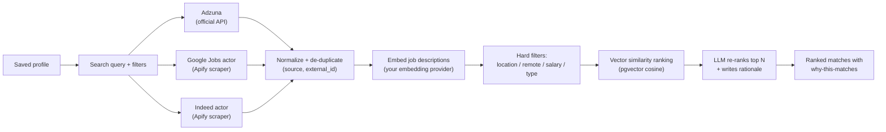
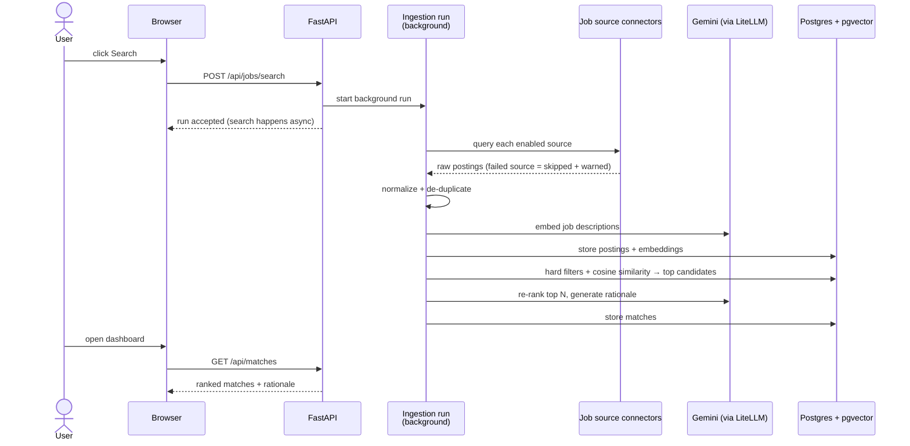

# 3 — Job Discovery & Matching

**Status: planned** — lands in Week 2 of v1 (issues #6–#11). This guide describes the
finished v1 behaviour.

## The idea

You search once; the app fans out to multiple job sources, normalizes and de-duplicates the
results, then ranks them against your saved profile — with a plain-language "why this
matches" on the best ones.

## The flow

<!-- diagram: job-discovery-flow -->

A failing source never breaks the search — it is skipped with a warning surfaced in the UI.

## What happens on a search (behind the scenes)

<!-- diagram: search-sequence -->

Searches run in the background — you can navigate away; results appear when the run
finishes.

## Choosing sources: official API vs third-party scraper

| Source | Type | Badge | Needs |
|---|---|---|---|
| Adzuna | Official API | "Official API" | Free Adzuna key |
| Google Jobs actor | Third-party scraper | "Third-party scraper" | Your Apify account |
| Indeed actor | Third-party scraper | "Third-party scraper" | Your Apify account |

Before a scraper-based source can be enabled you must **acknowledge its terms-of-use
disclosure** in a modal. The badge stays visible on every job card so you always know where
a listing came from. Scraping happens through *your* Apify account under *your* responsibility
— the app ships a tool, not a scraping service.

## Reading the results

- **Rank** — blend of vector similarity, your hard filters, and the LLM re-rank
- **"Why this matches"** — a generated explanation on the top matches, so you can judge the
  ranking instead of trusting a black box
- **Priority slider** — shift weighting between *role fit* and *company fit*; the ranking
  updates accordingly
- **Filters** — location, remote, job type, posting date

## Privacy

- Job search calls go only to the sources you enabled, using your keys/tokens
- Re-ranking and rationale generation use your configured LLM provider; only match-relevant
  text (job description vs profile) is sent — never your raw resume file

## Back

[← Upload & profile review](02-upload-and-profile.md) · [Getting started](01-getting-started.md)
