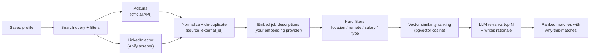
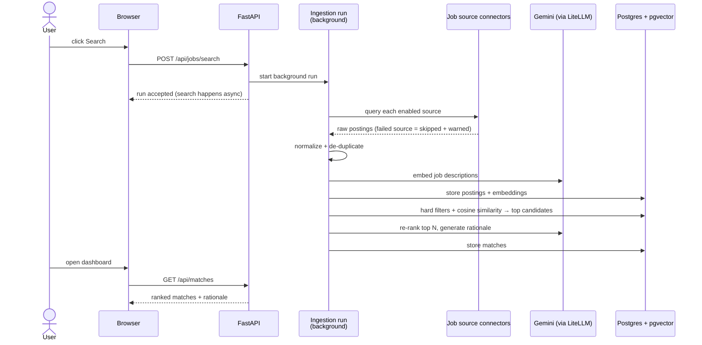
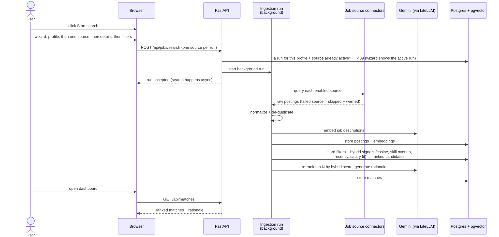

# 3 — Job Discovery & Matching

**Status: partially live** — the search UI (editable query, source selection, live run
banner), Adzuna + the LinkedIn Apify actor, and de-duplication all work today (issues #7
and #8). Embeddings, hard filters, ranking, and the "why this matches" rationale land with
the matching issues (#9–#11); those sections below describe the finished v1 behaviour.

## The idea

You search once; the app fans out to the sources you enabled, normalizes and de-duplicates
the results, then ranks them against your saved profile — with a plain-language "why this
matches" on the best ones.

## Search is always explicit

A search only starts when **you** submit one — nothing runs automatically, not on page
load, not when a profile is completed. The `/jobs` page shows the exact query that will be
sent, seeded from your profile headline and skills and **editable** before you submit; you
also pick which enabled sources to include. After the run, its status endpoint echoes the
stored query so you can always see what was searched.

## The flow

<!-- diagram: job-discovery-flow -->

A failing source never breaks the search — it is skipped with a warning surfaced in the UI.

Today (issues #7–#8): the `/jobs` page starts a background run from an editable, seeded
query, `GET /api/jobs/searches/{id}` reports its status with per-source results/warnings
while a live banner polls it, and postings are de-duplicated per `(source, external_id)` —
a re-search refreshes the stored postings instead of duplicating them.

## What happens on a search (behind the scenes)

<!-- diagram: search-sequence -->

Searches run in the background — you can navigate away; results appear when the run
finishes.

## Choosing sources: official API vs third-party scraper

| Source | Type | Badge | Needs |
|---|---|---|---|
| Adzuna | Official API | "Official API" | Free Adzuna key |
| LinkedIn jobs scraper | Third-party scraper | "Third-party scraper" | Your Apify account — paid per result (~$1 / 1,000 results) |

The [Setup page](../app/setup) lists every source with its badge always visible. Official
API sources enable themselves once their keys exist; before a scraper-based source can be
enabled you must **acknowledge its terms-of-use disclosure** in a modal. The badge stays
visible on every job card so you always know where a listing came from. Scraping happens
through *your* Apify account under *your* responsibility — the app ships a tool, not a
scraping service. Adding another Apify actor later is a `connectors.yaml` entry plus a
mapper module — no core changes.

## Reading the results

- **Rank** — blend of vector similarity, your hard filters, and the LLM re-rank
- **"Why this matches"** — a generated explanation on the top matches, so you can judge the
  ranking instead of trusting a black box
- **Priority slider** — shift weighting between *role fit* and *company fit*; the ranking
  updates accordingly
- **Filters** — location, remote, job type, posting date

## Privacy

- Job search calls go only to the sources you enabled, using your keys/tokens
- Re-ranking and rationale generation use your configured LLM provider; only match-relevant
  text (job description vs profile) is sent — never your raw resume file

## Back

[← Upload & profile review](02-upload-and-profile.md) · [Getting started](01-getting-started.md)
