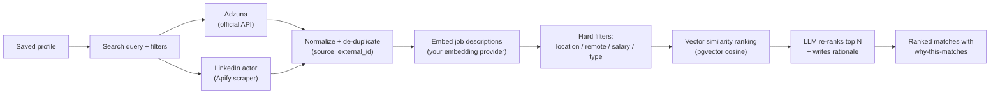
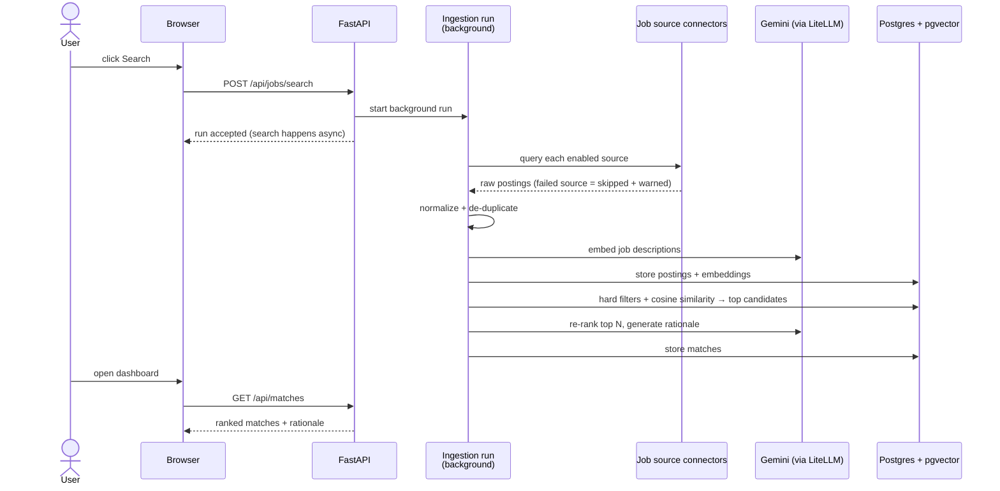

# 3 — Job Discovery & Matching

**Status: partially live** — the search UI (profile selector, per-source queries, filters,
live run banner), Adzuna + the LinkedIn Apify actor, LLM-generated per-source queries with
Regenerate, de-duplication, embeddings, and the hard-filter + cosine ranking query all work
today (issues #7–#9 and the search-queries follow-up). The `/api/matches` endpoint, LLM
re-rank, "why this matches" rationale, and the priority slider land with the remaining
matching issues (#10–#11); those sections below describe the finished v1 behaviour.

## The idea

You search once; the app fans out to the sources you enabled, normalizes and de-duplicates
the results, then ranks them against your saved profile — with a plain-language "why this
matches" on the best ones.

## Search is always explicit — and filter-first

A search only starts when **you** submit one — nothing runs automatically, not on page
load, not when a profile is completed. The `/jobs` page shows exactly what will be sent,
per source, and everything is editable before you submit:

- **Search queries per source** — generated by the LLM at extraction time, stored on your
  profile, and shown as structured fields (title, skills, and exclusions where the source
  supports them). Adzuna searches use a precise title phrase plus any-of skills and
  exclusions; LinkedIn (now an AI-powered natural-language search) gets a sentence like
  "Senior Android Engineer role with Kotlin and Java". Since the classic keyword search is
  being retired, a **Regenerate** button re-runs the LLM against your profile's *current*
  content whenever you want a fresh variant.
- **Stale queries are flagged, never silently reused** — if you edit the profile after the
  queries were generated, the page says "Queries are stale — press Regenerate."
- **Filters travel as filters** — location, country, minimum salary, and result count are
  structured fields, mapped to each source's native parameters (e.g. Adzuna's
  `salary_min`); they are never glued into the query text (except LinkedIn's salary
  mention, since that source has no salary filter at all).
- After the run, its status endpoint echoes the stored request so you can always see what
  was searched, per source.

Queries are seeded from your profile (target title, headline, top skills) even before any
LLM ran, so you can search without generating anything.

**Salary filters and currency, honestly:** the minimum-salary field is applied as a real
filter where a source supports it — Adzuna does, LinkedIn does not (the salary mention is
folded into the natural-language query instead). Two caveats: the number is sent as-is, so
make sure it matches the search country's currency; and Adzuna's salary coverage varies a
lot by country — in India, for example, structured salaries that high are rare, so a 50
LPA minimum can legitimately return zero Adzuna hits while LinkedIn still returns plenty.
Lower or clear the field if a source comes back empty.

## The flow

<!-- diagram: job-discovery-flow -->

A failing source never breaks the search — it is skipped with a warning surfaced in the UI.

Today (issues #7–#9 + the search-queries follow-up): the `/jobs` page starts a background run
from per-source, editable queries, `GET /api/jobs/searches/{id}` reports its status with
per-source results/warnings while a live banner polls it, the run's postings are listed
(unranked) under the banner once it finishes, and postings are de-duplicated per
`(source, external_id)` — a re-search refreshes the stored postings instead of duplicating
them. Ranked matches arrive with the matching issues (#10–#11).

## How matching content is prepared (live since #9)

- **Job descriptions are embedded at ingest** — every normalized posting gets a vector
  (title + description) from your embedding provider in one batch per source. Very long
  descriptions are truncated at 6,000 characters (the embedding model's input limit).
  Postings whose embedding call fails are still stored — they match through filters only
  until a re-search embeds them, and the run reports an "embeddings unavailable" warning.
- **Your profile is embedded on every content change** — create, manual save, re-upload
  merge, and gap-fill answers all refresh the profile vector, so ranking (issue #10) never
  needs to re-embed your profile per query.
- **Hard filters run in SQL before ranking** — location (case-insensitive substring),
  remote type, job type, and posted-within; a posting without a known posting date is
  excluded when a posted-within filter is active.
- **Ranking is pgvector cosine distance** (`embedding <=> profile_vector`) — queryable in
  SQL today; the match pipeline (#10) builds directly on that query.
- **Storage facts** — embeddings live in `vector(768)` columns on `job_posting` and
  `profile`, pinned to Gemini `text-embedding-004`. Changing embedding models requires a
  new column + backfill migration — the dimension is never changed silently. There is no
  ANN index (HNSW/ivfflat) yet: at single-user scale a sequential scan is fast enough.

## What happens on a search (behind the scenes)

<!-- diagram: search-sequence -->

Searches run in the background — you can navigate away; results appear when the run
finishes.

## Choosing sources: official API vs third-party scraper

| Source | Type | Badge | Needs |
|---|---|---|---|
| Adzuna | Official API | "Official API" | Free Adzuna key |
| LinkedIn jobs scraper | Third-party scraper | "Third-party scraper" | Your Apify account — paid per result (~$1 / 1,000 results) |

The [Setup page](../app/setup) lists every source with its badge always visible. Official
API sources enable themselves once their keys exist; before a scraper-based source can be
enabled you must **acknowledge its terms-of-use disclosure** in a modal. The badge stays
visible on every job card so you always know where a listing came from. Scraping happens
through *your* Apify account under *your* responsibility — the app ships a tool, not a
scraping service. Adding another Apify actor later is a `connectors.yaml` entry plus a
mapper module — no core changes.

## Reading the results

- **Rank** — blend of vector similarity, your hard filters, and the LLM re-rank
- **"Why this matches"** — a generated explanation on the top matches, so you can judge the
  ranking instead of trusting a black box
- **Priority slider** — shift weighting between *role fit* and *company fit*; the ranking
  updates accordingly
- **Filters** — location, remote, job type, posting date

## Privacy

- Job search calls go only to the sources you enabled, using your keys/tokens
- Re-ranking and rationale generation use your configured LLM provider; only match-relevant
  text (job description vs profile) is sent — never your raw resume file

## Back

[← Upload & profile review](02-upload-and-profile.md) · [Getting started](01-getting-started.md)
