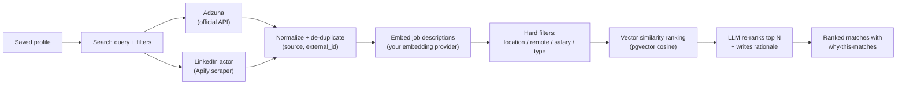
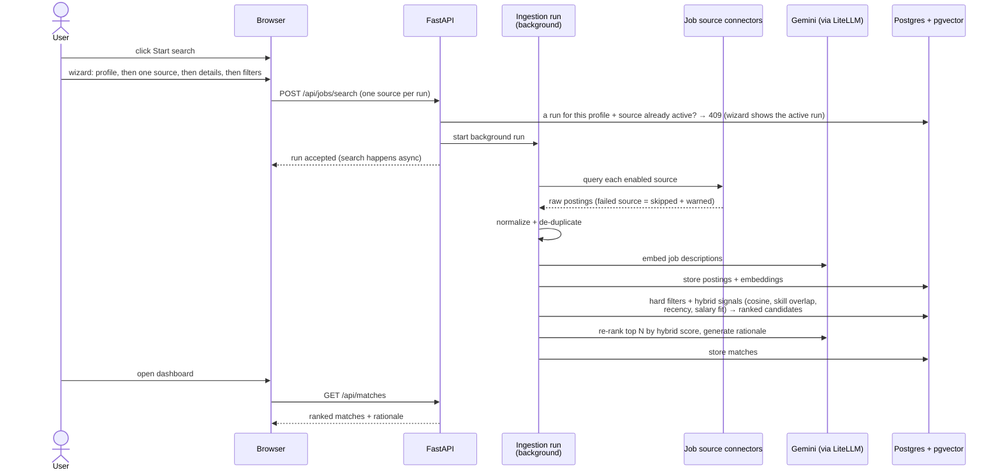

# 3 — Job Discovery & Matching

**Status: live** — the search UI (profile selector, per-source queries, filters, live run
banner), Adzuna + the LinkedIn Apify actor, LLM-generated per-source queries with
Regenerate, de-duplication, embeddings, the hard-filter + cosine ranking query, ranked
matches with the LLM re-rank and "why this matches" rationale, the `GET /api/matches`
dashboard, and the priority-weight slider (role fit ↔ company fit, issue #11) all work
today (issues #7–#11 and the search-queries follow-up). The `MATCH_WEIGHT_*` values in
`.env` are the server defaults; the slider overrides them per profile at read time.

## The idea

You search once; the app fans out to the sources you enabled, normalizes and de-duplicates
the results, then ranks them against your saved profile — with a plain-language "why this
matches" on the best ones.

## Search is always explicit — and filter-first (v3 #30)

A search only starts when **you** submit one through the **Start search** wizard on the
`/jobs` sidebar — nothing runs automatically, not on page load, not when a profile is
completed. One run targets **one profile and one source**; parallel runs on other
sources are fine. The wizard has four steps:

1. **Profile** — the owning track (prefilled with the active profile from the URL).
2. **Source** — one of the enabled sources; source badges (Official API / Third-party
   scraper) are always visible, and a source without its API key is disabled.
3. **Details** — prefilled from your profile (title, skills, exclusions from the stored
   AI queries or the seed, plus location, country, posted-within, and salary band), all
   editable. Includes maximum salary in addition to minimum. The selected source's
   declared advanced filters (rendered generically from `/api/sources` — no per-source
   forms anywhere) live in a collapsed "More filters for this source" accordion — open it
   only if you want to override the source-specific knobs.
4. **Review** — a summary of every value that will be sent: profile, source, search
   title, must-have skills, nice-to-have skills, exclusions, location, country, posted
   within, salary band, result count, and a one-line roll-up of the advanced filters that
   are actually set (everything unset reads "none"). The run starts only from this step.

Freshness has a single knob: **Posted within** (step 3) is the shared day-filter —
sent exactly on Adzuna and converted to the closest `datePosted` bucket on LinkedIn
(`anyTime`/`past24Hours`/`pastWeek`/`pastMonth`). There is no separate LinkedIn date filter
(the redundant override was removed in v3 #30); the read-side expiry filter applies on
top either way.

Supporting details that carry over from earlier versions:

- **Search queries come from your profile** — generated by the LLM at extraction time,
  stored per source, shown as structured fields in step 3. Adzuna searches use a precise
  title phrase plus must-have (`what_and`) and nice-to-have (`what_or`) skill keywords and
  exclusions; LinkedIn (now an AI-powered natural-language search) gets a semantic brief —
  `"{title} with {skills}, {seniority} level"`, with excluded terms appended as a
  `not …` clause (the only exclusion channel LinkedIn's AI search has) and no salary text
  (issue #35). Since the classic keyword search is
  being retired, a **Regenerate** button re-runs the LLM against your profile's *current*
  content whenever you want a fresh variant.
- **Queries refresh themselves when their inputs change** — generation consumes the full
  profile (skills, preferences, country, summary) and v4 tracks a content hash of those
  inputs. When you save an edited profile, or a gap-fill chat turn completes your
  preferences, the backend regenerates the stored queries in the background — nothing to
  press. Manual **Regenerate** always forces a fresh variant; unchanged profiles never
  pay for an LLM call. Default (automatic) generation runs at temperature 0, so the
  stored specs are reproducible; only the manual regenerate asks the LLM for a creative
  variant.
- **Filters self-resolve from your profile** — if the request omits location, country,
  salary band, or seniority, the backend fills each one from the profile
  (`contact.country`, `preferences.target_location`, `preferences.salary_min/max/currency`,
  `preferences.seniority`) before searching;
  anything the request sends explicitly still wins. The run status echo shows the
  *resolved* payload, so you always see what was actually searched.
- **Filters travel as filters** — location, country, salary band (min/max), and result count are
  structured fields, mapped to each source's native parameters (e.g. Adzuna's
  `salary_min`); they are never glued into the query text. LinkedIn's keywords drop
  salary mention entirely (issue #35) — that source has no salary filter and the AI
  search treats the mention as noise.
- After the run, its status endpoint echoes the stored request so you can always see what
  was searched, per source.

Queries are seeded from your profile (target title, headline, top skills) even before any
LLM ran, so you can search without generating anything.

**Salary filters and currency, honestly:** the minimum/maximum-salary fields are applied as real
filter where a source supports it — Adzuna does, LinkedIn does not (LinkedIn gets the salary
band as a scored preference only, not query text). Two caveats: the number is sent as-is, so
make sure it matches the search country's currency; and Adzuna's salary coverage varies a
lot by country — in India, for example, structured salaries that high are rare, so a 50
LPA minimum can legitimately return zero Adzuna hits while LinkedIn still returns plenty.
Lower or clear the field if a source comes back empty.

## The flow

<!-- diagram: job-discovery-flow -->

A failing source never breaks the search — it is skipped with a warning surfaced in the UI.

Today (issues #7–#10 + the search-queries follow-up): the `/jobs` page starts a background run
from per-source, editable queries, `GET /api/jobs/searches/{id}` reports its status with
per-source results/warnings while a live banner polls it, the run's postings are listed
(unranked) under the banner once it finishes, and postings are de-duplicated per
`(source, external_id)` — a re-search refreshes the stored postings instead of duplicating
them. Ranked matches with the "why this matches" rationale are shown below the banner and
refresh after every run.

## Searches belong to a profile (live since v3 #24)

Career tracks live side by side, and jobs found for one track must not leak into another:

- **Every search has an owning profile.** `POST /api/jobs/search` requires a
  `profile_id` (400 when missing, 404 for an unknown profile); the run row stores it
  as a database-level `job_search.profile_id`.
- **Notes on ownership are enforced by the API, not just the UI.** The run-status and
  run-postings endpoints require a `profile_id` query param and answer 404 when the
  run does not belong to you.
- **"Found by this run" is append-only.** Postings link to searches through the
  `search_posting` join table (unique per `(search_id, posting_id)`), replacing the old
  mutable pointer that a re-search used to overwrite. A posting re-found by a later
  search gains a new association row; earlier runs' results views are untouched.
- **Active runs survive a page refresh.** `GET /api/jobs/searches?profile_id=` lists the
  profile's recent runs (fresh first, no request echo); the `/jobs` page derives its run
  banners from it, so a search you started keeps its progress banner after reloading.
- **The URL carries the current profile.** On `/jobs` the selected profile is the
  `?profile=` URL param (same convention as `/profile`); switching profiles resets the
  run state and refetches that profile's matches.

## Match corpus is per profile (live since #25)

Matching only ever scores the profile's **own** corpus: the distinct postings found by
searches whose owning `profile_id` is that profile. A posting found by profile A's
searches is invisible to profile B's matches, even if the target roles overlap. A
profile with no searches yet has an empty corpus and zero matches until its first run.

Already ingested a global (pre-scoping) corpus of matches? Nothing is deleted
automatically — rebuild is explicit per profile, and only appears when needed:

- **Discrepancy detection** — the status endpoint reports `stale_count`: how many stored
  matches for that profile are posts *not* found by that profile's own searches. The
  rebuild affordance is hidden until this count is non-zero (or a rebuild run is active
  or failed), so a clean profile shows no extra UI.
- **"Rebuild matches for this profile"** (in the `/jobs` sidebar footer, under the
  Start search button; also `POST /api/profiles/{id}/rebuild-matches`) refreshes
  the profile embedding, scores the profile's scoped corpus, and **drops stored matches
  whose posting is no longer in that corpus** — the cleanup for stale cross-profile rows.
  `stale_count` returns to 0 afterwards and the affordance disappears.
- The rebuild runs in the background; the run reports the corpus size (postings
  found by the profile's searches) and how many were scored, with status queryable
  afterwards via `GET /api/profiles/{id}/rebuild-matches` (returns `status: "idle"` with
  the computed `stale_count` when the profile has never rebuilt).

## Freshness: closed and stale postings never surface (live since #26)

Matches and search results share one read-side expiry filter, applied in SQL:

| Posting state | Visible? |
|---|---|
| Closed (`is_closed`) | never |
| Source-reported expiry in the past (`expires_at < now()`) | never |
| No expiry, posted within the grace window | yes |
| No expiry, no known posting date | yes (unknown age is not proof of staleness) |
| No expiry, posted more than `STALE_POSTING_DAYS` ago (default 45) | never |

Per-source expiry signals: LinkedIn (Apify actor) reports `expireAt`, which is mapped to
`expires_at` and is authoritative — the grace window does not apply to it (a posting can
be listed for months with a future expiry). Adzuna's API provides no expiry field, so its
postings rely entirely on the grace window. Re-fetching a posting refreshes its expiry
from the source (a re-fetched posting that no longer reports one is un-expired and
becomes grace-window-managed again).

The filter is read-time only: stored matches for expired postings may remain in the
database (and count toward rebuild's corpus checks) but never render — no dead leads on
the dashboard. Your `posted_within_days` filter stacks on top of this as before.

## Freshness at query time: "Posted within" (live since #27)

The search form's "Posted within" select (Any time / Last 24 hours / Last week / Last
month) sends `max_days_old` (1–90) with the search request and narrows what the sources
return — before anything is scraped or stored. Each source maps it to its native
freshness parameter:

| Source | Parameter | Mapping |
|---|---|---|
| Adzuna (official API) | `max_days_old` | exact day count |
| Apify LinkedIn (scraper) | `datePosted` bucket | ≤1 day → `past24Hours`, ≤7 → `pastWeek`, ≤30 → `pastMonth`, wider/none → `anyTime` |

The shared filter is independent of the read-side layer above: a run with "Last week"
still passes its results through the expiry filter (a scraper-reported old date is still
excluded on read). Sources that support no freshness parameter simply ignore it, and the
choice is recorded in the run's query echo for reproducibility. There is no separate
LinkedIn "Date posted" advanced filter — the redundant declaration was removed in v3 #30
(the buckets above are the single knob for LinkedIn freshness).

## Advanced per-source filters (live since #28)

Every source declares the advanced filters it supports in one schema
(`SourceFilterDecl`); the backend validates values against the declaring source
(unknown key, wrong type, or bad enum → 400 naming the offending key), and each
connector maps validated values to its native parameters. Declarations are served
by `GET /api/sources` (`filters`), so the UI can render them generically — a new
source that declares filters works everywhere with no per-source code.

On the search page (live since #29) the form is generated from exactly these
declarations: each source's accordion section grows an "Advanced filters" block
built by one generic renderer (a toggle for `boolean`, a dropdown for `select`,
a number field for `number`, and a comma-separated field or text field otherwise),
with the values riding in that source's `source_queries[name].options`. Client-side
validation is generated from the same declarations; the backend stays the source
of truth. Stored LLM-chosen options (`search_query_v2`) are pre-filled and editable
in the same fields.

**This table is the living filter reference** — it mirrors the declarations in
`backend/app/adapters/job_sources/` (`adzuna.py` and `connectors.yaml`):

| Source | Filter | Values / form | Notes |
|---|---|---|---|
| Adzuna (official API) | `title_only` | on/off toggle | Match the title phrase instead of the full description |
| Adzuna (official API) | `job_type` | select: full-time / part-time / contract / permanent (optional) | Adzuna contract filters — one at a time, so contradictory mixes are impossible |
| Adzuna (official API) | `distance_km` | integer | Distance from the location; only applied when a location is set |
| Adzuna (official API) | `sort_by` | select: relevance / date / salary | Adzuna's result ordering |
| Apify LinkedIn (scraper) | `distance_miles` | integer | Actor `distance` field (miles) |
| Apify LinkedIn (scraper) | `under_10_applicants` | on/off toggle | Actor `under10Applicants` field |
| Apify LinkedIn (scraper) | `company_ids` | list of LinkedIn company IDs | Multiselect-text; advanced targeting |
| Apify LinkedIn (scraper) | `geo_id` | text | LinkedIn `geoId`; overrides the location field; preferred deterministic form |

Shared filters outside this scheme: `max_days_old` (#27), `salary_min` and
`salary_max` (the salary min/max fields are shared request filters, not per-source
options — Adzuna maps both to native params), `results_wanted`, and `location`/
`country`. LinkedIn has no salary filter; its keywords are a semantic NL brief with
no salary text (#35). LinkedIn's `limitPerSource` is capped per run by
`MAX_APIFY_RESULTS_PER_RUN` (default 250; the actor bills per result).
LLM-generated per-source specs may fill option fields the source declares
(`search_query_v4` specs); invented keys are dropped rather than stored.

### How terms reach each source (v4 issues #33/#34/#35)

Search text is rendered per source with a fixed, test-locked **precedence
table** — the connectors only map the rendered term plan onto their API
params, they never decide combinations:

- **Adzuna**: when the spec has a title, it becomes `what_phrase` and is
  combined with `what_and` (must-have `skills_all`) / `what_or` (nice-to-have
  `skills`) and `what_exclude`; the free-text query is only sent as `what`
  when there is **no** title.
- **Multi-pass Adzuna runs (v4 issue #34)**: with a title phrase, the connector
  runs a second `title_only=true` pass automatically (deduped by posting id,
  keeping the broad pass) unless you set `title_only` yourself. Page 2 is
  fetched only when page 1 fills its 50 rows and `results_wanted` is larger.
  Every call counts against `MAX_ADZUNA_CALLS_PER_RUN` (default 4; formula:
  sub-queries × pages) — when the budget runs out the run stops with a log
  line instead of failing. With no salary floor set, Adzuna also receives
  `salary_include_unknown=1` so postings without published salaries stop
  being silently dropped.
- **LinkedIn (v4 issue #35)**: the synthesized keywords are a semantic NL brief —
  `"{title} with {skills}, {seniority} level"` (seniority resolved from the profile;
  phrase omitted when unset; no salary text). A user-typed request `query`
  **overrides** the synthesized brief; otherwise the synthesis wins. A spec `query`
  only carries through when there is no title to synthesize from. The spec's
  exclude terms are appended as a `not …` clause to whichever keywords won — NL is
  the only exclusion channel since LinkedIn's AI-search migration dropped the URL
  filters.

## How matching content is prepared (live since #9)

- **Job descriptions are embedded at ingest** — every normalized posting gets a vector
  (title + description) from your embedding provider in one batch per source. Very long
  descriptions are truncated at 6,000 characters (the embedding model's input limit).
  Postings whose embedding call fails are still stored — they match through filters only
  until a re-search embeds them, and the run reports an "embeddings unavailable" warning.
  Postings that never come back through a search (e.g. fetched before the embedding
  feature existed) can be embedded without re-fetching via
  `backend/scripts/backfill_embeddings.py` (run inside the API container — see the script
  header; it also re-scores profiles so the matches appear immediately).
- **Your profile is embedded on every content change** — create, manual save, re-upload
  merge, and gap-fill answers all refresh the profile vector, so ranking never needs to
  re-embed your profile per query.
- **Hard filters run in SQL before ranking** — the freshness filter (above), location
  (case-insensitive substring), remote type, job type, and posted-within; a posting
  without a known posting date is excluded when a posted-within filter is active.
- **Ranking is a hybrid blend (#37)** — after each search run, every posting in the
  scoped corpus gets SQL-computed signals (cosine `vector_score`, `skill_score`,
  `recency_score`, `salary_score`; see "How matches are scored" below) and is stored in
  the `match` table (upsert, so repeat runs refresh scores instead of duplicating rows).
- **Storage facts** — embeddings live in `vector(768)` columns on `job_posting` and
  `profile`, pinned to Gemini `gemini-embedding-001` with `EMBEDDING_DIMENSIONS=768`
  (the model's native output is 3072; the API truncates it via `dimensions`). Google
  retired `text-embedding-004` (the original pin) in 2026 — the model switch needed no
  schema change because both emit 768-dim vectors here. Changing the *dimension*
  requires a new column + backfill migration — never a silent dimension change. There
  is no ANN index (HNSW/ivfflat) yet: at single-user scale a sequential scan is fast
  enough.

## How matches are scored (live since #10, hybrid since #37)

- **Every posting in your scoped corpus gets a SQL signal pass** (no LLM needed):
  - **`vector_score`** — clamped cosine similarity (1 − distance) between the posting
    vector and your profile vector. Null when the posting never got an embedding.
  - **`skill_score`** — the share of your top `MATCH_SKILL_SIGNAL_SKILLS` skills (25 by
    default) that appear word-bounded in the posting's title + description.
  - **`recency_score`** — `exp(-days_since_posting / MATCH_RECENCY_DECAY_DAYS)` (14 by
    default); postings with an unknown date stay at a neutral 0.5.
  - **`salary_score`** — 1.0 when the posting band overlaps your preferred salary band,
    decaying to 0 as it drifts out; 1.0 when the band or currency is unknown, 0.5 when
    your profile states no salary preference.
  All four are recomputed in one bulk SQL statement after each search and on profile saves.
- **Postings without an embedding are no longer excluded** — they score on
  skill + recency + salary (renormalized to the same 0–1 scale) instead of being excluded.
- **The top postings get an LLM re-rank** — the postings with the highest *hybrid* score
  (the same weighted blend, chosen over stored sub-scores — not cosine alone since #37)
  *that don't already have a rationale* are sent to your LLM (one batched call) which
  returns a role-fit score (0–10), a company-fit score (0–10), and a "why this matches"
  rationale. The prompt now also sees the profile's salary band, remote preference, and,
  per posting, the concrete skill overlap. The cap is `RERANK_TOP_N` (10 by default).
- **`final_score`** — a weighted blend:
  `match_weight_vector × vector_score + match_weight_skill × skill_score +
  match_weight_recency × recency_score + match_weight_salary × salary_score +
  match_weight_role_fit × role_fit/10 + match_weight_company_fit × company_fit/10`
  (defaults `0.35 / 0.25 / 0.15 / 0.15 / 0.05 / 0.05` in `.env`; the weights must sum to
  1.0 and startup fails fast if your env drifts). The priority slider still overrides
  only the role/company split per profile at read time. Re-ranked postings add the LLM
  verdicts on top of the SQL base; everything else keeps the SQL blend.
- **Repeat searches are cheap** — postings whose rationale is still valid are not sent to
  the LLM again; a search that adds nothing new to the top costs zero LLM tokens. The run
  banner shows the matching stage's outcome, including the re-rank token usage.
- **Profile edits clear rationales** — saving profile content or applying gap-fill answers
  re-scores all matches in SQL and clears the now-stale rationales and sub-scores (no LLM
  call on the save path). The next search re-ranks the new top N against the updated
  profile.
- **Re-rank failure degrades gracefully** — if the LLM call fails, matches are still
  ranked by the hybrid score; the rationale is simply missing, and the run reports a
  "re-rank unavailable" warning.
- **`GET /api/matches` reads stored matches** — the dashboard filters (location, remote,
  job type, posted-within) and sort (best match / similarity / newest) are applied at
  read time, so changing filters never triggers re-scoring. The endpoint returns 409 if
  the profile has no embedding (e.g. the embedding provider was down at save time) —
  re-save the profile once the provider works.

## What happens on a search (behind the scenes)

<!-- diagram: search-sequence -->

Searches run in the background — you can navigate away; results appear when the run
finishes.

### One active run per profile + source

Firing the same source twice for the same profile (double billed results, double quota
burn) is prevented server-side: `POST /api/jobs/search` answers **409 Conflict** with the
active run's id. The Start search wizard shows *"A search for this profile and source is
already running"* and a **Go to active run** button that attaches you to that run's banner.
Different sources for the same profile can still run at the same time. If a run gets stuck
(crash, restart), a sweeper marks it failed after `MAX_RUN_AGE_MINUTES` (default 30) so you
can start a new one.

### Rate limits and retries

Every outbound call — LLM generation, embeddings, Adzuna, Apify — retries
automatically with exponential backoff (plus a provider-supplied `Retry-After` when
given). Defaults (`LLM_RETRY_ATTEMPTS=3`, `LLM_RETRY_BASE_DELAY_S=1.0` in `.env`) fit the
Gemini free tier. If a source still fails after the retries, the run degrades
gracefully: the failed source is skipped with a warning in the run banner and the rest
of the search continues. A hard-failed run (every source down) is shown in red in the
banner with the per-source reasons.

## Choosing sources: official API vs third-party scraper

| Source | Type | Badge | Needs |
|---|---|---|---|
| Adzuna | Official API | "Official API" | Free Adzuna key |
| LinkedIn jobs scraper | Third-party scraper | "Third-party scraper" | Your Apify account — paid per result (~$1 / 1,000 results) |

The [Setup page](01-getting-started.md) lists every source with its badge always visible. Official
API sources enable themselves once their keys exist; before a scraper-based source can be
enabled you must **acknowledge its terms-of-use disclosure** in a modal. The badge stays
visible on every job card so you always know where a listing came from. Scraping happens
through *your* Apify account under *your* responsibility — the app ships a tool, not a
scraping service. Adding another Apify actor later is a `connectors.yaml` entry plus a
mapper module — no core changes.

## Reading the results

- **Rank** — `final_score`: the weighted blend of vector similarity, skill overlap,
  recency, and salary fit, plus the LLM's role-fit and company-fit ratings on re-ranked
  postings (see "How matches are scored" above)
- **"Why this matches"** — a generated explanation on the top matches, so you can judge
  the ranking instead of trusting a black box; expand it on each match card
- **Filters** — location, remote, job type, posting date, a sort selector (best
  match / similarity / newest), and the priority slider (below); all applied to the
  stored matches at read time
- **Profile scope** — the sidebar's "Searching as profile" selector scopes every search
  run and the match list to one profile track (the same selector is also in the Global
  configuration dialog; both always show the same track)
- **Priority slider** — shift weighting between *role fit* and *company fit* (see below)

## The priority slider (issue #11)

The slider in the filter panel re-weights the ranking between the two LLM signals:
slide toward **role fit** to prioritise postings whose *work* matches your skills and
seniority; slide toward **company fit** to prioritise employers that match your
trajectory.

- **Live and cheap** — moving the slider re-orders the stored matches instantly. It
  re-weights the AI's already-stored role-fit/company-fit ratings in SQL; no LLM call,
  no re-scoring, no token cost.
- **Saved per profile** — the position persists per profile track (a debounced save ~
  400 ms after you stop sliding). Reload or switch profiles and the slider comes back
  where you left it; each track keeps its own setting.
- **What it can't do** — postings the AI never re-ranked have no company signal, so they
  keep their plain similarity score regardless of the slider; the slider reorders only
  the re-ranked top N relative to each other and to unranked rows. It is a *read-time*
  view: it never changes which postings are fetched or re-ranked, and it never writes to
  your profile content or revision history.
- **Server defaults still exist** — the slider's default position matches the
  `MATCH_WEIGHT_*` values in `.env`. Changing those env values applies to new score
  writes; the per-profile slider position (once moved) overrides them at read time.

## Privacy

- Job search calls go only to the sources you enabled, using your keys/tokens
- Re-ranking and rationale generation use your configured LLM provider; only match-relevant
  text (job description vs profile) is sent — never your raw resume file

## Back

[← Upload & profile review](02-upload-and-profile.md) · [Getting started](01-getting-started.md)
