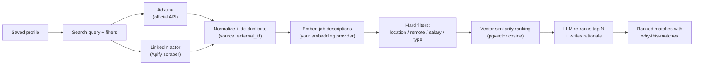
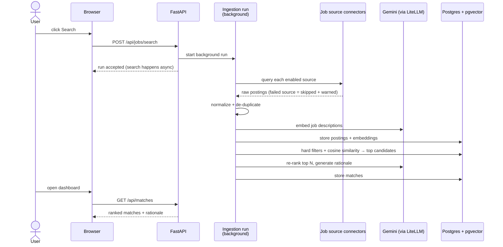

# 3 — Job Discovery & Matching

**Status: live** — the search UI (profile selector, per-source queries, filters, live run
banner), Adzuna + the LinkedIn Apify actor, LLM-generated per-source queries with
Regenerate, de-duplication, embeddings, the hard-filter + cosine ranking query, ranked
matches with the LLM re-rank and "why this matches" rationale, the `GET /api/matches`
dashboard, and the priority-weight slider (role fit ↔ company fit, issue #11) all work
today (issues #7–#11 and the search-queries follow-up). The `MATCH_WEIGHT_*` values in
`.env` are the server defaults; the slider overrides them per profile at read time.

## The idea

You search once; the app fans out to the sources you enabled, normalizes and de-duplicates
the results, then ranks them against your saved profile — with a plain-language "why this
matches" on the best ones.

## Search is always explicit — and filter-first

A search only starts when **you** submit one — nothing runs automatically, not on page
load, not when a profile is completed. The `/jobs` page shows exactly what will be sent,
per source, and everything is editable before you submit:

- **Search queries per source** — generated by the LLM at extraction time, stored on your
  profile, and shown as structured fields (title, skills, and exclusions where the source
  supports them). Adzuna searches use a precise title phrase plus any-of skills and
  exclusions; LinkedIn (now an AI-powered natural-language search) gets a sentence like
  "Senior Android Engineer role with Kotlin and Java". Since the classic keyword search is
  being retired, a **Regenerate** button re-runs the LLM against your profile's *current*
  content whenever you want a fresh variant.
- **Stale queries are flagged, never silently reused** — if you edit the profile after the
  queries were generated, the page says "Queries are stale — press Regenerate."
- **Filters travel as filters** — location, country, minimum salary, and result count are
  structured fields, mapped to each source's native parameters (e.g. Adzuna's
  `salary_min`); they are never glued into the query text (except LinkedIn's salary
  mention, since that source has no salary filter at all).
- After the run, its status endpoint echoes the stored request so you can always see what
  was searched, per source.

Queries are seeded from your profile (target title, headline, top skills) even before any
LLM ran, so you can search without generating anything.

**Salary filters and currency, honestly:** the minimum-salary field is applied as a real
filter where a source supports it — Adzuna does, LinkedIn does not (the salary mention is
folded into the natural-language query instead). Two caveats: the number is sent as-is, so
make sure it matches the search country's currency; and Adzuna's salary coverage varies a
lot by country — in India, for example, structured salaries that high are rare, so a 50
LPA minimum can legitimately return zero Adzuna hits while LinkedIn still returns plenty.
Lower or clear the field if a source comes back empty.

## The flow

<!-- diagram: job-discovery-flow -->

A failing source never breaks the search — it is skipped with a warning surfaced in the UI.

Today (issues #7–#10 + the search-queries follow-up): the `/jobs` page starts a background run
from per-source, editable queries, `GET /api/jobs/searches/{id}` reports its status with
per-source results/warnings while a live banner polls it, the run's postings are listed
(unranked) under the banner once it finishes, and postings are de-duplicated per
`(source, external_id)` — a re-search refreshes the stored postings instead of duplicating
them. Ranked matches with the "why this matches" rationale are shown below the banner and
refresh after every run.

## How matching content is prepared (live since #9)

- **Job descriptions are embedded at ingest** — every normalized posting gets a vector
  (title + description) from your embedding provider in one batch per source. Very long
  descriptions are truncated at 6,000 characters (the embedding model's input limit).
  Postings whose embedding call fails are still stored — they match through filters only
  until a re-search embeds them, and the run reports an "embeddings unavailable" warning.
  Postings that never come back through a search (e.g. fetched before the embedding
  feature existed) can be embedded without re-fetching via
  `backend/scripts/backfill_embeddings.py` (run inside the API container — see the script
  header; it also re-scores profiles so the matches appear immediately).
- **Your profile is embedded on every content change** — create, manual save, re-upload
  merge, and gap-fill answers all refresh the profile vector, so ranking never needs to
  re-embed your profile per query.
- **Hard filters run in SQL before ranking** — location (case-insensitive substring),
  remote type, job type, and posted-within; a posting without a known posting date is
  excluded when a posted-within filter is active.
- **Ranking is pgvector cosine distance** (`embedding <=> profile_vector`) — every
  embeddable posting is scored against the profile after each search run and stored in the
  `match` table (upsert, so repeat runs refresh scores instead of duplicating rows).
- **Storage facts** — embeddings live in `vector(768)` columns on `job_posting` and
  `profile`, pinned to Gemini `gemini-embedding-001` with `EMBEDDING_DIMENSIONS=768`
  (the model's native output is 3072; the API truncates it via `dimensions`). Google
  retired `text-embedding-004` (the original pin) in 2026 — the model switch needed no
  schema change because both emit 768-dim vectors here. Changing the *dimension*
  requires a new column + backfill migration — never a silent dimension change. There
  is no ANN index (HNSW/ivfflat) yet: at single-user scale a sequential scan is fast
  enough.

## How matches are scored (live since #10)

- **Every embeddable posting gets a `vector_score`** — clamped cosine similarity
  (1 − distance) between the posting vector and your profile vector, computed in SQL and
  stored per (profile, posting) after each search run.
- **The top postings get an LLM re-rank** — the postings with the highest vector score
  *that don't already have a rationale* are sent to your LLM (one batched call) which
  returns a role-fit score (0–10), a company-fit score (0–10), and a "why this matches"
  rationale. The cap is `RERANK_TOP_N` (10 by default).
- **`final_score`** — for re-ranked postings: `0.4 × vector_score + 0.4 × role_fit/10 +
  0.2 × company_fit/10` (server defaults `MATCH_WEIGHT_VECTOR`, `MATCH_WEIGHT_ROLE_FIT`,
  `MATCH_WEIGHT_COMPANY_FIT` in `.env`; the priority slider overrides the role/company
  split per profile at read time). Everything else keeps `final_score = vector_score`.
- **Repeat searches are cheap** — postings whose rationale is still valid are not sent to
  the LLM again; a search that adds nothing new to the top costs zero LLM tokens. The run
  banner shows the matching stage's outcome, including the re-rank token usage.
- **Profile edits clear rationales** — saving profile content or applying gap-fill answers
  re-scores all matches in SQL and clears the now-stale rationales and sub-scores (no LLM
  call on the save path). The next search re-ranks the new top N against the updated
  profile.
- **Re-rank failure degrades gracefully** — if the LLM call fails, matches are still
  ranked by vector score; the rationale is simply missing, and the run reports a
  "re-rank unavailable" warning.
- **`GET /api/matches` reads stored matches** — the dashboard filters (location, remote,
  job type, posted-within) and sort (best match / similarity / newest) are applied at
  read time, so changing filters never triggers re-scoring. The endpoint returns 409 if
  the profile has no embedding (e.g. the embedding provider was down at save time) —
  re-save the profile once the provider works.

## What happens on a search (behind the scenes)

<!-- diagram: search-sequence -->

Searches run in the background — you can navigate away; results appear when the run
finishes.

### Rate limits and retries

Every outbound call — LLM generation, embeddings, Adzuna, Apify — retries
automatically with exponential backoff (plus a provider-supplied `Retry-After` when
given). Defaults (`LLM_RETRY_ATTEMPTS=3`, `LLM_RETRY_BASE_DELAY_S=1.0` in `.env`) fit the
Gemini free tier. If a source still fails after the retries, the run degrades
gracefully: the failed source is skipped with a warning in the run banner and the rest
of the search continues. A hard-failed run (every source down) is shown in red in the
banner with the per-source reasons.

## Choosing sources: official API vs third-party scraper

| Source | Type | Badge | Needs |
|---|---|---|---|
| Adzuna | Official API | "Official API" | Free Adzuna key |
| LinkedIn jobs scraper | Third-party scraper | "Third-party scraper" | Your Apify account — paid per result (~$1 / 1,000 results) |

The [Setup page](../app/setup) lists every source with its badge always visible. Official
API sources enable themselves once their keys exist; before a scraper-based source can be
enabled you must **acknowledge its terms-of-use disclosure** in a modal. The badge stays
visible on every job card so you always know where a listing came from. Scraping happens
through *your* Apify account under *your* responsibility — the app ships a tool, not a
scraping service. Adding another Apify actor later is a `connectors.yaml` entry plus a
mapper module — no core changes.

## Reading the results

- **Rank** — `final_score`: a blend of vector similarity and the LLM's role-fit and
  company-fit ratings for re-ranked postings, plain similarity otherwise (see "How
  matches are scored" above)
- **"Why this matches"** — a generated explanation on the top matches, so you can judge
  the ranking instead of trusting a black box; expand it on each match card
- **Filters** — location, remote, job type, posting date, plus a sort selector (best
  match / similarity / newest); applied to the stored matches
- **Priority slider** — shift weighting between *role fit* and *company fit* (see below)

## The priority slider (issue #11)

The slider above the filter bar re-weights the ranking between the two LLM signals:
slide toward **role fit** to prioritise postings whose *work* matches your skills and
seniority; slide toward **company fit** to prioritise employers that match your
trajectory.

- **Live and cheap** — moving the slider re-orders the stored matches instantly. It
  re-weights the AI's already-stored role-fit/company-fit ratings in SQL; no LLM call,
  no re-scoring, no token cost.
- **Saved per profile** — the position persists per profile track (a debounced save ~
  400 ms after you stop sliding). Reload or switch profiles and the slider comes back
  where you left it; each track keeps its own setting.
- **What it can't do** — postings the AI never re-ranked have no company signal, so they
  keep their plain similarity score regardless of the slider; the slider reorders only
  the re-ranked top N relative to each other and to unranked rows. It is a *read-time*
  view: it never changes which postings are fetched or re-ranked, and it never writes to
  your profile content or revision history.
- **Server defaults still exist** — the slider's default position matches the
  `MATCH_WEIGHT_*` values in `.env`. Changing those env values applies to new score
  writes; the per-profile slider position (once moved) overrides them at read time.

## Privacy

- Job search calls go only to the sources you enabled, using your keys/tokens
- Re-ranking and rationale generation use your configured LLM provider; only match-relevant
  text (job description vs profile) is sent — never your raw resume file

## Back

[← Upload & profile review](02-upload-and-profile.md) · [Getting started](01-getting-started.md)
