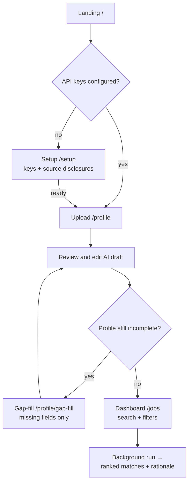

# UI Implementation Plan (v1)

**Status:** Planned
**Tracks:** GitHub issues #4, #5, #8, #11 (frontend scope) — issue #2 is backend-only
**Plan of record:** [v1-implementation-plan.md](v1-implementation-plan.md) §7 (pages), [frontend standards](../instructions/frontend-nextjs.md)
**Doc impact:** this plan doc + page-flow diagram; guides 02/03 updated as pages land

---

## 1. Current state (scaffold inventory)

- Next.js 16.3.3 (App Router), React 19, TypeScript strict, Tailwind v4 (CSS-first `@theme`
  in `globals.css`; system light/dark tokens already present)
- `lib/api/`: typed client (`apiFetch` + `ApiError`) + `schema.d.ts` generated via
  `npm run generate:api`
- One feature component (`BackendStatus`) — hand-rolled loading/error/retry pattern
- Missing: routing beyond `/`, `components/ui/` primitives, server-state library, form library

**Next 16 caveat:** `frontend/AGENTS.md` warns that Next 16 differs from training data.
Implementation must consult the bundled docs in `node_modules/next/dist/docs/` before using
App Router APIs (params, layouts, route handlers).

## 2. Locked decisions (this planning pass)

| Decision | Choice | Rationale |
|---|---|---|
| UI primitives | **shadcn/ui** (Radix + Tailwind v4, copy-in to `components/ui/`) | Accessible dialogs (focus trap, escape, aria) for the disclosure modal for free; matches the `components/ui/` standard |
| App shell | **Responsive top app bar** (sticky, 3 sections); content in max-width container | 3 links fit on mobile without a hamburger; dashboard keeps full width. Sidebar variant deferred — revisit if sections grow |
| Theme | **System light/dark** via existing `prefers-color-scheme` tokens | Already scaffolded; no toggle JS |
| Server state | **TanStack Query** | Mandated by frontend standards; fetch caching/invalidation/polling |
| Forms | **react-hook-form + zod** (`@hookform/resolvers`) | Mandated by frontend standards |

**New dependencies (justified):** `@tanstack/react-query`, `react-hook-form`, `zod`,
`@hookform/resolvers` (standards-mandated); shadcn/ui brings `@radix-ui/*`,
`class-variance-authority`, `clsx`, `tailwind-merge`, `lucide-react` (copy-in model, tree of
small packages, no runtime CSS-in-JS).

## 3. Route map & page flow

| Route | Page | Delivered by |
|---|---|---|
| `/` | Landing: status + primary CTA "Upload resume" | exists (polish in #4) |
| `/setup` | Keys, sources, disclosure acknowledgment | #8 |
| `/profile` | Upload + review/edit + revision history | #2 (API) + #4 (UI) |
| `/profile/gap-fill` | Conversational missing-field flow | #5 |
| `/jobs` | Search, filters, ranked matches, priority slider | #7–#11 |

<!-- diagram: ui-page-flow -->

## 4. Design system

- **Tokens:** extend `globals.css` `@theme` with shadcn semantic variables (background,
  card, muted, primary, destructive, border, ring) for light and dark; components reference
  tokens, never raw hex
- **`components/ui/`** (copy-in, then trimmed to house style): button, badge
  (`official-api` / `third-party-scraper` variants), card, dialog, input, textarea, label,
  select, slider (priority weight), skeleton, separator, toast (sonner), form (RHF bindings)
- **`lib/utils.ts`:** `cn()` (clsx + tailwind-merge)
- **Server Components by default**; `"use client"` pushed to the smallest leaf (forms,
  dialogs, anything with state/effects)
- **Accessibility:** visible focus rings, labeled inputs with error slots, keyboard-navigable
  modals (shadcn/Radix gives focus trap + escape), `aria-live` for async status changes

## 5. Data layer

- Every backend call goes through `lib/api` typed functions using generated types; regenerate
  with `npm run generate:api` in the same change as any backend schema change
- Add `apiUpload` helper to `lib/api/client.ts` for multipart (must not set
  `Content-Type` manually — the browser sets the boundary); no upload progress events exist
  in `fetch`, so parse status is an indeterminate state, not a percentage
- TanStack Query: `QueryClientProvider` in a small client-only `<Providers>` mounted in the
  root layout; query keys per domain (`["health"]`, `["resume", id]`, `["matches", filters]`);
  errors surface inline + toast, never swallowed
- Backend-run polling: queries for in-flight ingestion/scoring use `refetchInterval` while a
  run is active; navigating away and back must not break the run (standards: background-work UX)
- 4xx mapping: 413/415/422 from `POST /api/resume` render as specific, human messages
  (too large / unsupported type / no readable text)

## 6. Page-by-page

### 6.1 Landing `/` (polish in #4)

Hero + `BackendStatus` (existing) + CTA → `/profile`. Loading skeleton, API-down error with
retry, and a "keys missing → /setup" hint are the states.

### 6.2 Setup `/setup` (#8)

- Key-status cards per provider (from `POST /api/setup/check`): configured / missing,
  embedding-capability warning before first search
- Source list with **badges always visible** ("Official API" / "Third-party scraper")
- Enabling a scraping source opens the disclosure dialog; the enable button stays disabled
  until acknowledgment; `POST /api/sources/{name}/enable` with `acknowledged_disclosure: true`
- States: loading skeleton per card, error + retry, all-configured empty state

### 6.3 Upload & review `/profile` (#2 API, #4 UI)

- **Upload zone:** drag-drop + file picker; client-side pre-checks (extension, size) for fast
  feedback; backend re-validates (source of truth); after upload, show extracted-text preview
  with page count and a "not saved yet — review below" notice
- **Review form (RHF + zod):** sections — contact, headline, skills (tag input),
  experience (repeatable), education (repeatable), preferences; AI-extracted fields carry an
  "AI" badge + tinted background until edited
- **Save** → `PATCH /api/profile`; every save appends a `profile_revision`; a **history
  drawer** lists revisions with field-level old → new diffs
- **Re-upload** → merge/diff review screen (accept/reject per changed field)
- States: parsing skeleton, 413/415/422 error cards, empty-profile state

### 6.4 Gap-fill `/profile/gap-fill` (#5)

- Chat-style thread; questions come from `completeness` — **only genuinely missing fields**
- Quick-reply chips for closed sets (remote preference, seniority), text input otherwise;
  answers PATCH the profile and appear in the revision trail as `gap_fill`
- Completion state: summary of what was added → CTA to `/jobs`

### 6.5 Job dashboard `/jobs` (#7–#11)

- **Search bar** seeded from profile title/skills; editable before each run
- **Filters:** location, remote, job type, posted-within; **source multi-select** with badges
- **Run banner:** background run status (started → per-source results/warnings → done);
  page stays usable during the run; failures degrade to per-source warnings, never a dead page
- **Match cards:** rank, title, company, location, salary, source badge, score; expandable
  "why this matches" rationale (top N); cards 1-col on mobile, 2-col on xl
- **Priority slider** (#11): role-fit ↔ company-fit; changing it re-weights ranking
- States: no-search-yet empty state, run-in-progress skeletons, all-sources-failed error,
  zero-matches empty state with filter hints

## 7. Responsive rules (global)

- One codebase, tokens shared: single-column below `md`, two-column forms at `md+`,
  match cards 2-col at `xl`; dialogs stay usable at 375 px; touch targets ≥ 44 px
- Verify at 375 / 768 / 1280 px before any UI task is "done"

## 8. Build order

1. **#4** — foundation + biggest slice: shadcn init, tokens, `components/ui/` set,
   TanStack Query provider, app shell/nav, `/profile` upload + review + revision history
2. **#5** — gap-fill chat UI
3. **#7 + #8** — `/setup` (keys, badges, disclosure dialog) + `/jobs` search form
4. **#9–#11** — match cards + rationale, run-status polling UI, priority slider, polish

Per-issue DoD: `npm run lint && npm run build` pass; types regenerated if backend changed;
loading/error/empty states implemented; responsive + a11y checklist done.
