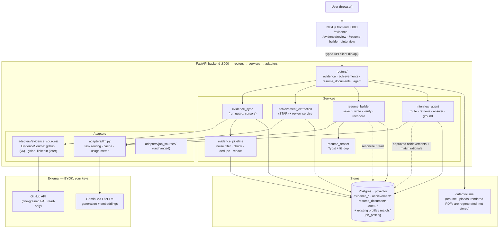
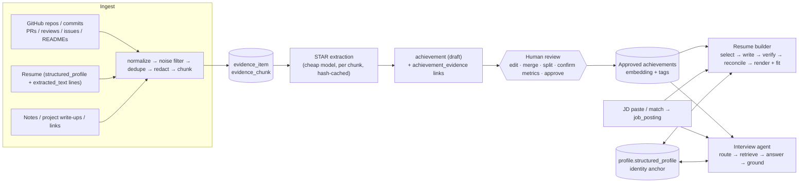

# v6 plan — Developer Evidence Engine: evidence-grounded resume builder + knowledge-base interview agent

**Status:** Proposed plan of record for v6 (owner decisions recorded in §14.3)
**Date:** 2026-10-02
**Depends on:** v1 (#1–#12), v2 (#13–#23), v3 (#24–#30), v4 (#31–#39), v5 (#40–#47, hardening) — all merged; Alembic head `0021` (`0022` if v5 #43's schema audit adds a migration).
**Issue range:** #48 – #61, one GitHub milestone `v6`, branches `v6/milestone` and `v6/{issue}-{slug}` (AGENTS.md git workflow). Per-issue plans (`v6-issue-NNN-*.md`) are written before each issue starts (v1 retro lesson).
**Inputs read:** `v6-planning-prompt.md`, `v1-implementation-plan.md`, `v4-search-relevance-plan.md`, `docs/architecture.md`, `backend/app/models/*`, `adapters/llm.py`, `adapters/retry.py`, `adapters/job_sources/base.py`, `schemas/profile.py`, `core/config.py`, `docs/instructions/*`.

> **Verify-first note.** Four external facts below come from my background knowledge, not from this repo, and are dated: GitHub API rate-limit numbers, the `typst` PyPI wheel (bundled compiler, no system deps), Gemini model prices, and fine-grained-PAT permission names. Issue #50 and #56 each start with a one-hour spike that confirms them before code depends on them. Prices in §7 are labelled as assumptions.

---

## 0. Where the prompt and the repo disagree (read first)

| # | Prompt says | Repo says | v6 handling |
|---|---|---|---|
| 1 | "Resume input is PDF only" | `text_extraction.extract_docx` and `architecture.md` show v1 accepts PDF **and** DOCX | No change; v6 adds no input formats. v6 *outputs* PDF only. |
| 2 | "The existing profile" (singular identity anchor) | One `candidate` has **many** `profile` tracks (v1 #6); `match` is keyed on `profile_id` | Evidence is **candidate-scoped** (shared across tracks). Resume documents and agent sessions are **profile-scoped** (`profile_id` FK) — the profile is the anchor for each output. |
| 3 | "Audit trail like `profile_revision`" | `profile_revision.source` is a **native PG enum**, FK `RESTRICT` | Reusing it would need `ALTER TYPE … ADD VALUE` and would mix two audit domains. v6 adds a sibling `achievement_revision` table. `profile_revision` is untouched. |
| 4 | "Extend `llm.py` with model selection per task" | `generate()` / `parse_structured()` have **no per-call model**; they read `settings.llm_model` | Additive `task=` kwarg + settings (§7). Existing callers unchanged. |
| 5 | Resume rewriting needs per-bullet references | `structured_profile` bullets are bare strings with no IDs; v1 plan §11 said rewriting needs a planned per-bullet migration | v6 does **not** normalize `structured_profile`. Bullet-level provenance lives in the new `resume_document.content` JSONB. Zero changes to existing tables (§8). |
| 6 | Ingestion "resumable" | Background work is FastAPI `BackgroundTasks` (no queue); a process restart silently kills a run | Resumability is **cursor-in-DB** + run guard + sweeper (the v4 #36 pattern), not in-memory state. |
| 7 | Agent chat | `DbCommitMiddleware` commits the session at `http.response.start`; a streamed response would commit *before* the body is produced | MVP chat is **non-streaming JSON** (persist user message → generate → persist assistant message in one request). Streaming is v7 and needs its own session handling. |
| 8 | Docs must stay in sync | `architecture.md` header still links the v3 plan and omits v4; ER section is titled "v1" | Fixed in #61 along with the v6 additions. |
| 9 | "Only add a dependency if needed" | `httpx` is imported at runtime by `adapters/job_sources/base.py` but declared only in `[project.optional-dependencies].dev` (it arrives transitively via `litellm`) | Promote `httpx` to a runtime dependency in #48 (declaration fix, not a new dep). |
| 10 | Migration head `0020` (at the time of the original prompt) | Revision `0015` lives in `c3f4cc09d71f_add_posting_expiry_columns.py` (filename ≠ revision id) | Superseded: v5 (hardening) adds `0021` (+ optional `0022`), so v6 migrations are `0023`–`0027` with numeric filenames. |
| 11 | Hard requirement 3: "exactly 1 or 2 pages" | Owner decision 2026-10-02: the user picks **1, 2, 3 or 4** pages, and pages need not be *full* — the crux is **priority** of what fits | Page count is still exact and deterministic; the fill thresholds in the first draft are removed (§6.3). |

---

## Prerequisites from v5 (hardening)

v6 is written against the state v5 ([v5 plan](../v5/v5-hardening-plan.md)) leaves behind:

- **Tests** mirror `app/` (`tests/services/`, `tests/routers/`, …); v6 tests go there. The recorded/golden suites add one new top-level folder, `tests/eval/`.
- **Strict gates** apply to all v6 code: ruff `ALL`, pyright strict, coverage threshold, Prettier, strict typed ESLint, `npm test`.
- **Database:** every table with `updated_at` gets the `set_updated_at()` trigger through the helper from v5 #43; constraint/index names follow the naming convention added there; `alembic check` stays clean.
- **LLM cost:** `estimate_cost`, cost logging and the confirm-gated estimate pattern from v5 #47 already exist; v6 #49 builds the usage meter, task routing, cache and redaction **on top of them** rather than creating a second estimator.
- **Runtime:** explicit CORS, LLM timeouts (`LLM_TIMEOUT_S`) and bounded list endpoints are in place; new endpoints follow `docs/instructions/api-design.md`.

## 1. Executive summary and recommended architecture

**What v6 is.** A **Developer Evidence Engine**: pull what the user actually did (GitHub commits/PRs/reviews/issues/READMEs, the already-parsed resume, free-form notes) into one evidence store; distil it into **human-approved STAR achievements**; and build two features on that single approved knowledge base: (A) a 1-, 2-, 3- or 4-page ATS-friendly resume (page count chosen by the user) tailored to a pasted JD or an existing ranked match, shown as copyable, commentable data for review **before** any PDF is produced, and (B) an interview agent that answers in the user's voice with citations.

**The one idea that makes it trustworthy.** Nothing generative ever reads raw evidence at answer/write time without going through an **approved achievement** whose every claim is linked to evidence rows. Resume bullets and agent sentences carry `evidence_ids`; a deterministic checker (numbers, named technologies, dates must appear in the cited evidence or user-confirmed metrics) plus a cheap LLM judge gates output. No evidence → the system says so and asks the user to add a note.

**Recommended architecture (decisions, each with fallback in §3):**

| Area | Decision | Fallback |
|---|---|---|
| Source interface | New sibling `EvidenceSource` protocol (not `JobSource`) | Extend `JobSource` with an optional `sync()` — rejected, see ADR-1 |
| GitHub access | `httpx` + GraphQL for PRs/reviews/issues, REST for repos/commits (`since`, ETag); **token in `.env` only** | REST-only; encrypted-in-DB token (Fernet) in v7 |
| Knowledge layer | **Achievement store + RAG** in Postgres/pgvector: approved STAR achievements are the retrieval unit, evidence chunks are the citation/drill-down layer | Plain chunk RAG |
| Resume schema | Internal `ResumeContent` pydantic (JSON Resume–compatible + per-bullet provenance) | Plain JSON Resume |
| Rendering | **Typst** via the `typst` PyPI wheel, page count measured with the existing `pdfplumber`, deterministic priority-first fit (1–4 pages) | WeasyPrint (HTML→PDF) |
| LLM | Extend `adapters/llm.py` with `task` routing (classify / extract / write / judge), usage meter, `llm_output_cache` | Single model for everything (default) |
| Agent | Rule-first question router → hybrid retrieval over approved achievements → templated answer → grounding validator → one repair → refuse | Plain RAG chat |
| Background work | `BackgroundTasks` + DB cursors + partial-unique-index run guard (v4 #36) | — |
| Existing tables | **No changes.** 14 new tables, 5 migrations (`0023`–`0027`) | — |





---

## 2. Product scope

### 2.1 MVP (v6, 3–4 weeks)

- **Sources:** GitHub (own authored work, per-repo opt-in, private repos via PAT), existing resume (profile experience/project bullets + extracted-text lines as `resume_line` evidence), free-form notes (text), links stored as references (title + URL + optional pasted text; **no fetching** of portfolio/Play Store pages in v6).
- **Knowledge:** STAR achievement extraction, review/approve UI, audit trail, metric confirmation, repo→employer mapping.
- **Resume builder:** user-chosen length (1, 2, 3 or 4 pages), one Typst template with two variants (`classic`, `compact`), JD paste or "from match", priority-first content selection, **review view before any PDF** (copy as plain text / Markdown / JSON Resume, private-repo marks, per-section comments that trigger targeted rewrites), reconciliation panel against `structured_profile`, overlapping roles resolved by priority, then an explicit "Generate PDF".
- **Interview agent:** text chat, persisted sessions, question routing, citations, grounding validation, optional "prep for this match" context, rolling-summary memory.
- **Eval:** golden dataset, recorded-LLM CI suite, opt-in live suite.

### 2.2 v7

GitLab / Bitbucket connectors; LinkedIn export (zip) and Jira; fetching link content; streaming chat; template library beyond two variants; cover letters; mock-interview scoring/feedback; auto-propose achievement merges with an LLM; encrypted-in-DB tokens; local-only (Ollama) mode as a supported, tested profile.

### 2.3 Later

DOCX export; voice mode; per-employer resume variants as saved presets; cross-profile evidence analytics.

### 2.4 Non-goals (explicit)

Reading source code or diffs (v6 never fetches file contents or patches — only commit messages, PR/issue text, review comments, README, language stats, file *paths* for noise filtering); inventing or estimating metrics; auto-applying to jobs; multi-user auth; hosted SaaS; new resume *input* formats; fine-tuning or voice cloning; fabricating "voice" beyond first-person tone from user-approved text.

### 2.5 Existing screens and endpoints that change

| Surface | Change |
|---|---|
| `SiteHeader` nav | Adds Evidence, Resume builder, Interview |
| `/setup` + `POST /api/setup/check` | Reports `GITHUB_TOKEN` detected (never the value) and per-task model config |
| `/profile` page | "Build resume from evidence" CTA; conflict deep-links back to the field to edit (edits go through the existing `PATCH /api/profiles/{id}` → `profile_revision`) |
| `/jobs` `MatchCard` | Two buttons: "Tailor resume" → `/resume-builder/new?match=…`, "Prep interview" → `/interview/new?match=…` |
| `GET /api/matches`, `POST /api/jobs/search`, all profile endpoints | **Unchanged** |
| Docs | `architecture.md` (ER + sequence + system overview), new guides 04 and 05, `.env.example`, README |

---

## 3. Architecture decisions and trade-offs

### 3.1 `EvidenceSource` sibling vs. extending `JobSource`

| Dimension | Sibling `EvidenceSource` (chosen) | Extend `JobSource` |
|---|---|---|
| Lifecycle | `list_scopes → sync(scope, cursor) → items` (incremental, resumable) | `search(query) → postings` (stateless, one-shot) |
| Auth | Per-user token, per-scope opt-in | Per-app keys, per-source disclosure |
| Output | `EvidenceItemData` (commit, PR, …) | `JobPostingData` |
| Reuse | `retry.py`, `Transient`, config/disclosure idea, `registry` pattern | — |
| Risk | Two registries to learn | Pollutes the contract v1–v4 depend on; `search()` semantics don't fit |

**Decision:** sibling interface in `adapters/evidence_sources/{base,registry,github}.py`. Reuses `with_retry`; shares nothing else. **Fallback:** none needed — the cost of being wrong is one adapter file.

```python
class EvidenceSource(Protocol):
    name: str                      # "github"
    def is_configured(self) -> bool: ...
    async def identify(self) -> SourceIdentity: ...                      # login, emails, scopes
    async def list_scopes(self) -> list[ScopeCandidate]: ...             # repos
    async def sync_scope(self, scope: ScopeState) -> AsyncIterator[SyncPage]: ...  # yields items + next cursor
    def normalize(self, raw: RawEvidence) -> EvidenceItemData: ...
```

### 3.2 GitHub access

| Option | Rate cost | Complexity | Verdict |
|---|---|---|---|
| REST only | 1 request per list page, N+1 for PR reviews/files | Low | Fallback |
| GraphQL only | One query returns PRs + reviews + comments + files (cost in points) | Medium (pagination cursors, node limits) | Too heavy for commits-by-author |
| **REST for repos + commits, GraphQL for PRs/issues/reviews** | Primary 5,000/hr either way; ETag `304`s are free on REST | Medium | **Chosen** |

- Own-work filter: commits by `author=<login>` (+ configured extra emails), PRs/issues where `author.login == login`, review comments by the user.
- Request budget per run (`GITHUB_MAX_REQUESTS_PER_RUN`, default 1500) and a floor (`GITHUB_MIN_REMAINING_PCT`, default 10): when `X-RateLimit-Remaining` falls under the floor or a secondary limit (`Retry-After`) exceeds the retry policy, the run becomes `paused` with `resume_at`; the next start continues from per-scope cursors.
- No `PyGithub` (sync, heavy). `httpx` + small typed models.

### 3.3 Knowledge layer: plain RAG vs. achievement graph + RAG

| Dimension | Plain chunk RAG | **Achievement store + RAG (chosen)** | Graph DB / GraphRAG |
|---|---|---|---|
| Unit retrieved | Raw commit/PR chunks | Approved STAR achievement → expands to its evidence | Entities + edges |
| Human-in-loop | Nothing to approve | Natural approval gate (hard req. 2) | Heavy |
| Hallucination risk | High (model "stitches" commits) | Low (claims pre-structured, linked) | Medium |
| Behavioral questions | Weak (no story shape) | Strong (STAR already extracted) | Medium |
| Technical "why X over Y" | OK | Needs chunk drill-down (kept) | OK |
| Infra | pgvector | pgvector (same Postgres) | New datastore |
| Effort | Lowest | Medium | Highest |

**Decision:** achievements are first-class rows with `skills[]`, `impact_type`, `difficulty`, dates, repo, employer, and an embedding; the "graph" is relational joins (`achievement ↔ achievement_evidence ↔ evidence_item`, `achievement.skills` ↔ `structured_profile.skills`, `repo → employer`). Retrieval = hybrid score (below) over **approved** achievements, then top-k evidence chunks *linked to those achievements* for drill-down. **Fallback:** plain chunk RAG over `evidence_chunk` only (already stored, so it's a retrieval-function change).

### 3.4 Rendering: HTML→PDF vs. Typst vs. LaTeX

| Dimension | WeasyPrint (HTML→PDF) | **Typst (`typst` wheel)** | LaTeX (TeX Live / Tectonic) |
|---|---|---|---|
| Docker footprint | + pango/cairo apt libs | One pip wheel, no system libs | 400 MB–1 GB image or Tectonic binary + network fetches |
| Compile time | 0.5–2 s | ~50–300 ms | 2–10 s |
| Deterministic pagination | Reasonable; font/CSS-engine quirks | Strong with pinned version + bundled fonts | Strong but slow |
| ATS text extraction | Good (real text) | Good (real text, single column) | Good if careful with packages |
| Template authoring | HTML/CSS (familiar to a TS dev) | Small scripting language (learnable in an afternoon) | Painful |
| Fit loop viability (20–30 compiles) | Slow-ish | **Fast** | Too slow |

**Decision:** Typst. Template source lives in `backend/app/resources/typst/`, fonts (OFL-licensed, e.g. Source Sans 3 / Libertinus) in `backend/app/resources/fonts/`, passed through the compiler's font path so layout never depends on host fonts. Pin the `typst` version exactly. **Fallback:** WeasyPrint with a pinned font set; the fit loop and tests are renderer-agnostic by design (`PageMeter` = compile → bytes → `pdfplumber` page count).

### 3.5 GitHub token handling

`.env` only (`GITHUB_TOKEN`), like every other key. Never persisted to the DB, never logged, stripped from error messages. "Connect" in the UI = backend validates `GET /user` and shows login + granted permissions; the user rotates the token by editing `.env`. **Trade-off:** no paste-in-UI convenience. **Fallback (v7):** Fernet-encrypted column with the key in `.env` (adds `cryptography`). Key-management for a single-user local app buys little over `.env` today.

### 3.6 New dependencies

| Dependency | Why | Alternative considered |
|---|---|---|
| `typst` (PyPI) | Only renderer that is fast enough for a repeated-compile fit search and needs no system libs | WeasyPrint (+ apt packages), LaTeX |
| `httpx` → runtime dep | Already used; declaration fix | — |

Everything else (GitHub client, redaction, chunking, tokens via `litellm.token_counter`, text diffing via stdlib `difflib`, PDF page measurement via existing `pdfplumber`) uses stdlib or the current stack. **No** LangChain/LlamaIndex, no `PyGithub`, no `cryptography`, no `tiktoken`, no frontend dependency (preview = `<iframe>` on a blob URL).

---

## 4. Ingestion pipeline

### 4.1 Stages

```
sync run (guarded) → per scope (repo): fetch page(s) with cursor
  → normalize to EvidenceItemData → noise filter (deterministic) → upsert evidence_item
  → persist cursor (own transaction)           ← resumable boundary
after all scopes: chunking → dedupe → redaction preview → embed chunks → (user confirms) → extraction
```

Each stage is a pure function over typed models where possible (`services/evidence_pipeline/{noise,chunking,dedupe,redact}.py`) so the golden tests need no DB or network.

### 4.2 Common Evidence schema

```python
class EvidenceItemData(BaseModel):
    kind: EvidenceKind              # commit | pull_request | review_comment | issue | readme | repo_summary | note | link | resume_line
    external_id: str                # sha / PR node id / content hash for notes+resume lines
    project_key: str | None         # "owner/repo", "note:<slug>", "resume:<company>"
    title: str | None
    body: str                       # normalized text (no HTML, trimmed, secrets redacted copy kept separately)
    url: str | None
    occurred_at: datetime | None
    authored_by_user: bool
    meta: dict[str, object]         # additions/deletions, labels, languages, stars, parents, file paths (no content)
```

### 4.3 Noise filtering (deterministic, auditable)

Filtered items are **stored** with `status='filtered'` + `filter_reason` (shown behind a toggle so the user can restore one); they are never chunked or sent to an LLM.

| Rule | Detection |
|---|---|
| Merge commits | `parents > 1` or message `^Merge (branch|pull request|remote)` |
| Bots | author login ends `[bot]`, or in `{dependabot, renovate, github-actions, snyk-bot, …}` (configurable list) |
| Dependency/lockfile bumps | PR whose file paths are all in a lockfile/manifest set (`package-lock.json`, `yarn.lock`, `pnpm-lock.yaml`, `poetry.lock`, `Cargo.lock`, `go.sum`, `Podfile.lock`, `*.gradle` version bumps); commits by message `^(chore\(deps\)|bump|update dependency|upgrade)\b` with ≤ 5 changed lines |
| Trivia | message matches `^(wip|fix typo|typo|format|lint|cleanup|update readme|initial commit|\.+|misc|minor)\b` or ≤ 2 words with ≤ 3 changed lines |
| Generated / vendored | PR/commit touching only `dist/`, `build/`, `vendor/`, `*.min.*`, `*.snap` |
| Forks/mirrors | Fork repo with zero user-authored commits is not offered as a scope |

Note: the REST commit list has no per-commit file names; lockfile detection for direct commits therefore relies on message + size (GraphQL `additions/deletions/changedFilesIfAvailable`), and exact file-path detection applies to PRs. Squash-merge commits that equal a PR's merge commit are attached to the PR chunk, not counted twice.

### 4.4 Chunking (the extraction/retrieval unit)

| Chunk kind | Composition | Cap |
|---|---|---|
| `pr` | title + description + commit messages (≤ 20, deduped) + the user's review comments + comments addressed to the user (trimmed) + labels + file-path summary (counts, top dirs) | ~3k tokens; overflow → split description vs. review threads |
| `commit_cluster` | PR-less commits grouped per repo by activity burst (gap ≥ 7 days starts a new group), ≤ 30 commits | ~2k tokens |
| `repo_summary` | description, topics, language byte shares, stars/forks, README (first 4k chars), user's commit count + first/last date (contribution timeline) | ~2k tokens |
| `issue` | title + body + user's comments | ~1.5k tokens |
| `note` | paragraphs split at headings/blank lines, 10 % overlap | ~1.5k tokens |
| `resume_entry` | one `experience` / `project` entry with its bullets | ~800 tokens |

Chunks store `content_hash` (SHA-256 over normalized text + chunker version) so re-sync only re-embeds and re-extracts **changed** chunks.

### 4.5 Dedupe

- **Item level:** unique `(candidate_id, source_kind, external_id)`; notes/resume lines use a content hash as `external_id`.
- **Chunk level:** `content_hash` equality.
- **Achievement level:** after extraction, cosine ≥ 0.90 against approved/draft achievements of the same candidate + overlapping date range → *proposed* merge in the review UI. **Never auto-merged.**
- Resume ↔ GitHub overlap (the same project appears as a resume bullet and as PRs) is *linked*, not collapsed: one achievement can cite both a `resume_line` and PR items.

### 4.6 Resumability and rate limits

- `evidence_sync_run` has a partial unique index on `(source_id) WHERE status IN ('pending','running')` (copy of the v4 #36 design, including a `max_run_age_minutes` sweeper and a 409 carrying the active run id).
- Cursors live on `evidence_scope.cursor` JSONB: `{"commits_since": ts, "pr_end_cursor": str, "issue_end_cursor": str, "etags": {...}}`, committed **after each page** in a fresh session from `session_factory`.
- First sync looks back `EVIDENCE_LOOKBACK_YEARS` (default 6); later syncs use `since` watermarks.
- **Refresh (owner decision 2026-10-02):** the user can refresh GitHub history at any time. `POST /api/evidence/github/sync` takes `mode`: `incremental` (default — continues from the stored cursors, picks up new commits/PRs, re-fetches PRs updated since the watermark) or `full` (resets scope cursors and re-reads everything within the lookback window; existing items are upserted by `(candidate, kind, external_id)`, so approved achievements and their evidence links are never lost). Changed chunks (new `content_hash`) are re-embedded and re-extracted into **new draft** achievements; approved achievements are never overwritten — if a refreshed chunk changes an approved achievement's evidence, the review UI flags it "evidence updated" for re-review.
- Pause/resume as in §3.2. UI shows requests used, remaining budget, and "paused — resumes at HH:MM".

---

## 5. Knowledge layer: achievement extraction

### 5.1 Extraction contract (cheap model, per chunk)

```python
class ExtractedAchievement(BaseModel):
    title: str                                  # ≤ 80 chars, neutral
    situation: str; task: str; action: str
    result: str | None                          # null when the evidence states no outcome — never inferred
    metrics: list[MetricClaim]                  # {text, source_quote, evidence_ids}; verbatim numbers only
    skills: list[str]                           # canonicalized (alias map + matched to structured_profile.skills)
    impact_type: Literal["performance","reliability","revenue","cost","quality","velocity","scale","security","ux","leadership","other"]
    difficulty: int                             # 1–5 against a written rubric in the prompt (1 = routine fix … 5 = architectural/cross-team)
    evidence_ids: list[str]                     # required, non-empty, must be ⊆ the chunk's items
    time_range: tuple[date | None, date | None]
```

Rules baked into the prompt **and** enforced after parsing: 0–3 achievements per chunk; every field must be supportable from the chunk text; `result=null` beats a guess; numbers must appear verbatim in the cited evidence (regex check; violators are dropped to `needs_confirmation`); `evidence_ids ⊆ chunk items` (else the achievement is rejected and counted in run stats).

### 5.2 Lifecycle

`draft → approved | rejected → archived`. Only `approved` rows are embedded and visible to resume/agent. Editing an approved row re-embeds it and writes an `achievement_revision` diff. Approving requires ≥ 1 evidence link (service-enforced, tested). Metrics have `verified: "evidence" | "user"`; user-confirmed metrics record who/when in the revision. Archive, not delete (audit rows `RESTRICT`).

### 5.3 Employer mapping

Each repo scope carries an optional `employer_ref` (a `structured_profile.experience` entry identified by `company` + `start_date`, chosen by the user in review; suggested by commit-date overlap with experience dates). Achievements inherit it. Unmapped repos are "personal/open source" and map to `projects`, not `work`.

---

## 6. Resume generation

### 6.1 Canonical schema (`schemas/resume_document.py`)

JSON Resume–compatible sections (`basics`, `work`, `education`, `skills`, `projects`, `awards`, `certificates`) where `highlights` items are objects:

```python
class Bullet(BaseModel):
    text: str
    achievement_id: uuid.UUID | None   # None only for verbatim carry-over from the profile
    evidence_ids: list[uuid.UUID]
    metric_ids: list[str]              # which confirmed metrics it uses
    from_private: bool                 # any cited evidence is private — surfaced in the editor and on download
    score: float                       # selection score (drives trimming order)
    origin: Literal["generated","profile_verbatim","user_edited"]
    check: Literal["passed","needs_review","failed"]
```

`ResumeContent.to_json_resume()` flattens bullets to strings for export. Mapping `structured_profile ⇄ ResumeContent`: `contact→basics` (never sent to the LLM; filled at render), `experience→work` (`bullets→highlights`), `projects→projects`, `education`, `certifications→certificates`, `awards`, `skills`, `extra_sections` pass through. Pure functions, round-trip tested.

### 6.2 Pipeline

1. **Anchor.** Load the target `profile`; `contact`, `education`, employer names/titles/dates come from `structured_profile` and are authoritative for identity.
2. **Reconcile (deterministic).** Produce `conflicts[]` — never auto-resolved:
   - achievement dated outside every employment window for its mapped employer;
   - repo mapped to an employer not in the profile;
   - GitHub profile name/location ≠ `contact`;
   - evidence-backed skills missing from the profile (suggest add);
   - profile skills with zero evidence (informational; kept);
   - resume bullet text that contradicts a metric in approved achievements;
   - **overlapping roles** (see step 4) — informational, resolved by the priority rule.
   User resolves by editing the profile (existing PATCH → `profile_revision`) or marking "keep as is" on the document (recorded on the document, not the profile).
3. **JD analysis (cheap model, cached by JD hash).** Pasted JD or the match's `job_posting.description` + `match.rationale` → `{must_haves, nice_to_haves, keywords, seniority, domain}`. See §6.5 for how keywords are used without fabrication.
4. **Prioritize (JD is a boost, not the filter — owner decision 2026-10-02).** Every approved achievement first gets a **JD-independent base priority**: `base = 0.45 impact (metric present, impact_type weight) + 0.35 difficulty + 0.20 recency`. When a JD is present it adds an **alignment boost**: `priority = (1 − w)·base + w·alignment`, where `alignment ∈ [0,1]` = cosine to the JD digest blended with must-have skill overlap, and `w` is the *tailoring strength* (`RESUME_JD_WEIGHT`, default 0.30; the user picks Light 0.15 / Balanced 0.30 / Strong 0.50 per document; no JD ⇒ `w = 0`). Work that aligns with the JD gets a clear lift and is included; work that does not align is **never excluded for that reason** — it simply keeps its base priority and competes on impact, difficulty and recency. Diversify with MMR (λ = 0.7). This yields one **globally ranked candidate pool**; priority is the single currency used by every later step (including role priority and the overlap rule).
   - **Role priority and overlap rule (owner decision):** role priority = relevance-weighted sum of the role's top-3 achievement scores, plus a small recency term. If two employment roles overlap by ≥ `RESUME_OVERLAP_MIN_DAYS` (default 60; `is_current` ends today; unparsable dates ⇒ no overlap check), only the **higher-priority role** is included; the other is recorded in `omitted_roles` with the reason and shown in the review view with "Include anyway". Projects/open source are exempt. The user can rewrite that section later.
   - A role with no approved achievements falls back to its own profile bullets (`origin='profile_verbatim'`, ranked last) so no included role is empty and the document is never blank.
5. **Budget and oversample.** Seed bullet budget per page target (≈ 14–16 for 1 page, 26–30 for 2, ≈ 40 for 3, ≈ 52 for 4; heuristics, tuned in #60). Bullets are written for the top `ceil(budget × RESUME_CANDIDATE_OVERSAMPLE)` candidates (default 1.3) so the fit step has spare material; the rest stay ranked but unwritten ("available").
6. **Write (strong model).** One call per employer/project block, input = STAR + linked evidence snippets + verified metrics + the allowed-term set (§6.5). Output `Bullet[]` with claim-to-evidence mapping. Prompt rules: *action verb + scope + (verified) impact*, ≤ 2 lines at template width (~28 words), past tense (present for current role), no metric unless in `metric_ids`, no technology not in the evidence, no adjectives like "successfully/robust", never upgrade ownership verbs beyond the evidence.
7. **Verify.** Deterministic: every number, version, named tool, and year in the bullet must occur in the cited evidence or confirmed metrics. LLM judge (cheap model): "is each claim entailed by the evidence?" Fail → one regeneration with the violations listed → else `check="needs_review"` and the bullet is excluded from the fit until the user fixes or overrides it.
8. **Fit (§6.3)** decides what is *included*; everything else is listed as *not included* with a reason.
9. **Review (§6.4)** — nothing is rendered to PDF until the user asks.

### 6.3 Page fit: priority-first, deterministic

- Inputs: `page_target ∈ {1,2,3,4}` (UI: "1 page", "2 pages", "Multiple pages" with a 3 or 4 selector; max configurable via `RESUME_MAX_PAGES`), template variant, the priority-ordered pool of **written, passing** bullets (`needs_review` excluded), role anchors (below).
- **Objective:** maximize the total priority of what is included subject to `pages ≤ page_target`. Pages do **not** have to be full; there are no fill thresholds. A short document means the evidence ran out, and the review view says so.
- **Role anchors:** the highest-scoring bullet of each included role is boosted so every included role appears before any role's second bullet. If even the anchors do not fit, the lowest-priority roles are dropped whole (and listed as not included).
- **Pinned bullets:** bullets the user edited or pinned are never dropped before unpinned ones.
- **Search (deterministic, bounded):** for each typography preset P0 (comfortable: 10.5 pt, 0.7 in margins, normal spacing), P1 (10 pt, 0.6 in), P2 (floor: 9.5 pt, 0.5 in, tight spacing), binary-search the largest priority-ordered prefix that compiles within the page target (≈ 6–7 compiles each). Choose the preset that maximizes included priority mass; ties go to the roomier preset. Worst case ≈ 21 compiles, under `RESUME_FIT_MAX_COMPILES` (default 30). If nothing fits even at the floor, fail with `CannotFitError` and the list of items to review — never an extra page or unreadable type.
- **Output (`layout`)**: `{pages, preset, font_pt, margin_in, included_ids, not_included: [{id, priority, reason: did_not_fit | needs_review | overlap_omitted | not_written}], steps, short_on_evidence}`.
- Same input + same pinned compiler + bundled fonts ⇒ same result (tested by running twice and by property tests over synthetic documents for every target 1–4).
- **ATS rules (in the template, tested):** single column; standard headings (Experience, Education, Skills, Projects); real text, no images/tables/text boxes; contact in body not header/footer; ASCII-safe bullet glyph; dates in a consistent pattern; `pdfplumber` text extraction must return headings in order.

### 6.4 Review before PDF (owner decision 2026-10-02)

Creating or regenerating a document runs steps 1–8 and returns **structured data only** — content, layout (what is included/not included and why), conflicts and the gaps report. The fit step measures with an in-memory compile but no PDF is delivered.

- **Review view:** every section/bullet shown as plain, selectable text with evidence chips, check badges, origin badges and a **"Private repo" mark** where `from_private` (screen only; marks never appear in the PDF or in copied/exported text).
- **Copy / export (clean, no marks, contact from the profile):** copy a bullet, a section, or the whole resume as plain text or Markdown, or export JSON Resume — so the user can paste into their own resume format.
- **Included vs not included:** a ranked "not included" list with the reason; "Add" re-runs the fit (writing the bullet on demand if it was unwritten), "Remove" and reorder are available; omitted overlapping roles show "Include anyway".
- **Comments:** the user can attach a comment to a section or a bullet ("emphasize the migration, drop the tooling detail"). "Apply comments" regenerates **only the commented blocks**, passing each comment to the writer as an instruction that is followed only where the evidence supports it; results are re-verified and re-fitted. A comment that asks for an unsupported claim (e.g. "add Kubernetes") is not applied: the response says there is no evidence and offers "Add a note". Applied comments are kept as history.
- **Generate PDF** is a separate explicit step; it re-runs the fit with the current (possibly edited) content so the page target still holds.

### 6.5 Tailoring without fabrication

The JD changes **which true achievements are chosen and how they are ordered and phrased** — never **what is claimed**.

1. *Selection:* JD alignment is a bounded boost to priority (§6.2 step 4), never a filter; strong non-aligned work stays on the resume, and unsupported JD topics simply have no candidates.
2. *Allowed-term set (deterministic):* for each achievement, `allowed = (JD keywords + synonyms from `resources/skill_aliases.yaml`) ∩ (achievement.skills ∪ terms found in its linked evidence)`. The writer is told it may use JD wording **only** for terms in that set. Example: JD says "Kubernetes"; the evidence says "deployed with Helm charts to our cluster" and the achievement is tagged `kubernetes` by extraction (cited from the PR text) → allowed; if no evidence mentions it → not in the set, so it cannot appear.
3. *Verifier:* any recognized tool/technology/number/year in a bullet that is not in its evidence fails the check (§6.2 step 7), whatever the JD says.
4. *Skills section:* profile skills plus evidence-backed skills, **ordered** by JD relevance; JD keywords with no support are never added.
5. *Gaps report:* in the review view, each JD must-have with no supporting evidence is listed with the nearest evidence and an "Add a note" action. A note becomes evidence → achievement → review → eligible next time. This is the honest path to a better match.
6. *Trade-off, stated plainly:* a tailored resume may match fewer JD keywords than a stuffed one; the gaps report shows what is missing and how to legitimately close it.

---

## 7. Interview agent

### 7.1 Flow (per user message)

```
persist user message
→ resolve context: session job context (match rationale + posting digest, if any) + memory (summary + last N turns)
→ route question type (rules first, cheap-model fallback)
→ rewrite to a standalone query (cheap model; skipped when no pronouns/ellipsis and no history)
→ retrieve (hybrid) over approved achievements, expand to linked evidence chunks
→ write answer with template for the type (strong model), inline citations [A1] [E3]
→ ground (deterministic + judge) → repair once → else gap/refusal response
→ persist assistant message with citations + grounding report → return
```

### 7.2 Router and templates

| Type | Signals | Template |
|---|---|---|
| `intro` | "tell me about yourself", "walk me through your background" | Present → past → future in 60–90 s: profile summary + top 3 approved achievements by impact/recency |
| `behavioral` | "tell me about a time", conflict, failure, leadership | STAR from one best-matching achievement (≤ 2 if needed), first person |
| `technical` | "why did you choose X over Y", design, debugging, trade-offs | Context → options → decision → outcome, using drill-down evidence chunks (PR descriptions, README) |
| `motivation` | "why this role/company" | Requires job context; otherwise asks for a match/JD; grounded in the profile + approved achievements + the posting text |
| `hypothetical` | "how would you…" | Labeled as approach, not experience; may cite relevant achievements as precedent |
| `out_of_scope` | everything else | Brief redirect |

Decision-rationale questions ("why X over Y in project Z?") need explicit rationale evidence; absent it the agent answers "I can see *what* was done but not *why* in the evidence" and offers to turn the user's typed explanation into a new note (→ evidence → achievement, through review).

### 7.3 Retrieval

`score = 0.55·cosine(query, achievement.embedding) + 0.25·skill/entity overlap + 0.10·recency + 0.10·impact` (weights in Settings, same style as v4 #37), over `status='approved'`, optional filters by project/employer mentioned in the question. Top-6 → for each, top-2 evidence chunks by cosine among its linked chunks. Below `AGENT_MIN_RETRIEVAL_SCORE` ⇒ no-evidence response.

### 7.4 Citations and guardrails

- Context blocks carry stable short ids: `[A1]` (achievement) and `[E1]` (evidence item). The model must cite every factual sentence; the API returns `citations: [{marker, achievement_id, evidence_item_id, url, quote}]`; the UI renders chips that open the commit/PR/note.
- Validator: (1) sentences without a marker → flagged; (2) numbers/versions/proper-noun tech names/years not found in cited evidence → flagged; (3) judge entailment per sentence. One repair call removes or rewrites flagged sentences; if still failing, the response is the grounded subset plus "gaps". Contact details and employers are injected from `structured_profile`, never generated.
- Never invent: first-person voice is a *style* instruction (first person, concise, plain), not permission to embellish. Optional `style_notes` per session (user-typed).
- **Memory:** last `AGENT_HISTORY_TURNS` (default 6) verbatim; older turns folded into `agent_session.summary` by the cheap model; summary never stores new facts about the user (only conversation state).

---

## 8. LLM layer (extends `app/adapters/llm.py`)

| Change | Detail |
|---|---|
| Task routing | `LLMTask` StrEnum (`classify`, `extract`, `write`, `judge`, plus existing default). `generate()` / `parse_structured()` gain `task: LLMTask \| None = None`; model = `settings.llm_model_<task>` falling back to `settings.llm_model`. Existing callers pass nothing and behave identically. |
| Concurrency | `asyncio.Semaphore(settings.llm_max_concurrency)` (default 2) inside the wrapper so a 230-chunk extraction does not trip free-tier RPM; `retry.py` backoff still applies. |
| Usage meter | `UsageMeter` accumulates prompt/completion tokens per task for a run; cost comes from v5 #47's `estimate_cost()` (LiteLLM price map + `LLM_PRICE_*` overrides; unknown ⇒ "cost unavailable"). Surfaced in run stats and in a pre-run estimate. |
| Structured output | Unchanged mechanism (prompt-instructed JSON + pydantic + one repair). **Constraint from the existing comment about Gemini looping on large schemas:** extraction/writing schemas stay small; batch ≤ 8 bullets or ≤ 3 achievements per call. |
| Caching | `services/llm_cache.py::cached_parse_structured(task, key_parts, …)` → `llm_output_cache` keyed by SHA-256 of `(task, model, prompt_version, canonical inputs)`. Lives in the **service** layer so the adapter stays provider-only. Deviation from v4 #31 (hash column on the owning row) is deliberate: v6 has five task types and a single keyed table is less schema than five columns. Chunk-level `content_hash` still gates extraction. |
| Prompt versions | `ACHIEVEMENT_PROMPT_VERSION`, `BULLET_PROMPT_VERSION`, `JD_PROMPT_VERSION`, `AGENT_PROMPT_VERSION` constants (bumped ⇒ new hash ⇒ re-run) stamped on outputs. |
| Models | `classify`/`extract`/`judge`: Gemini Flash (current default). `write`: configurable; recommend a stronger model if the user's key allows (open question 5). All blank = one model. |
| Embeddings | `embed()` unchanged (768 dims, pinned). Items are **not** embedded; chunks and approved achievements are. |

### Cost estimate per full ingestion (assumptions — verify at #52)

Persona: 20 opted-in repos, ~1,500 commits, 150 PRs, 100 issues. After noise filtering ≈ 500 commits remain → ≈ 230 chunks (120 PR, 80 commit clusters, 20 repo summaries, 10 notes/resume entries).

| Step | Calls | Tokens (in / out) | Model class |
|---|---|---|---|
| Chunk embeddings | ~230 (batched) | ~350k in | embedding |
| STAR extraction | ~230 | ~345k in / ~115k out | extract |
| Achievement embeddings (after approval) | ~250 | ~60k in | embedding |
| **Total ≈** | | **~0.75M in / ~0.12M out** | |

At Gemini Flash-class pricing (my recollection: ≈ $0.30 / M in, ≈ $2.50 / M out — **assumption**) that is on the order of **$0.50 per full ingestion**, **$0 on the free tier** but ~10 RPM ⇒ roughly 25–40 minutes (hence resumable runs + concurrency cap). Per resume ≈ 10 writing calls + 1 JD call + judge ≈ 40k tokens (cents). Per chat turn ≈ 6–10k tokens. The UI shows a pre-run estimate (chunks × avg tokens × configured prices) and requires confirmation.

---

## 9. Data model (all new tables `candidate_id`-owned; **no existing table changes**)

**Amendments from issue planning (2026-10-02):** (1) the ORM class for `evidence_source` is `EvidenceSourceAccount` to avoid clashing with the `EvidenceSource` protocol (#48); (2) a 15th table, `achievement_extraction_run`, carries extraction progress/estimate/guard (#52); (3) `achievement.evidence_stale_at` flags approved achievements whose evidence changed after a refresh (#52/#53); (4) draft achievements are embedded at creation, retrieval still filters `status='approved'` (#52); (5) resume evidence is ingested from a chosen profile's `structured_profile` bullets, not `extracted_text` lines (#51); (6) removing a scope can purge its evidence, archiving dependent achievements (#61).

Conventions per `docs/instructions/database-postgres.md`: FK columns indexed, native enums, timestamptz, JSONB for flexible payloads, queryable ⇒ real column.

```python
class EvidenceKind(StrEnum): commit, pull_request, review_comment, issue, readme, repo_summary, note, link, resume_line
class EvidenceItemStatus(StrEnum): kept, filtered, excluded        # excluded = user removed
class SyncStatus(StrEnum): pending, running, paused, succeeded, failed
class AchievementStatus(StrEnum): draft, approved, rejected, archived

class EvidenceSource(Base):              # evidence_source — per-candidate connector config (cf. source_state)
    id, candidate_id (FK, idx), kind: str(50)           # 'github' | 'notes' | 'resume'
    account_login: str | None, extra_identities: JSONB  # emails for commit matching
    acknowledged_at: datetime | None                    # disclosure ack (private-repo text leaves the machine)
    last_synced_at, created_at
    UniqueConstraint(candidate_id, kind)

class EvidenceScope(Base):               # evidence_scope — a repo (or note collection) the user opted in
    id, source_id (FK), ref: str          # 'owner/repo'
    is_private: bool, enabled: bool       # default False for private
    content_level: Enum('messages_and_prs','metadata_only')
    employer_ref: JSONB | None            # {company, start_date} into structured_profile.experience
    cursor: JSONB, sync_state: SyncStatus, last_synced_at
    UniqueConstraint(source_id, ref)

class EvidenceSyncRun(Base):             # evidence_sync_run — run guard + progress
    id, source_id (FK), status: SyncStatus, progress: JSONB      # per-scope done/total, requests_used
    rate_limit: JSONB, resume_at: datetime | None, error: str | None, usage: JSONB
    created_at, updated_at
    Index('uq_evidence_sync_active_run', source_id, unique, postgresql_where="status IN ('pending','running')")

class EvidenceItem(Base):                # evidence_item — atomic, normalized
    id, candidate_id (FK, idx), scope_id (FK, nullable), kind: EvidenceKind
    external_id: str(255), project_key: str | None (idx), title, body: Text, url, occurred_at (idx)
    authored_by_user: bool, status: EvidenceItemStatus, filter_reason: str | None
    is_private: bool                     # copied from the scope at ingest; drives provenance marking everywhere downstream
    meta: JSONB, content_hash: str, created_at, updated_at
    UniqueConstraint(candidate_id, kind, external_id)

class EvidenceChunk(Base):               # evidence_chunk — extraction + retrieval unit
    id, candidate_id (FK, idx), kind: str, project_key, title, text: Text, token_count: int
    content_hash: str (idx), chunker_version: str, extracted_hash: str | None   # hash at last extraction
    contains_private: bool               # any member item is private
    embedding: Vector(768) | None, time_start, time_end, created_at, updated_at
class EvidenceChunkItem(Base):           # evidence_chunk_item: chunk_id, item_id  (PK pair, both FK idx)

class LLMOutputCache(Base):              # llm_output_cache
    key: str(64) PK, task: str, model: str, prompt_version: str, output: JSONB
    prompt_tokens: int, completion_tokens: int, created_at

class Achievement(Base):                 # achievement
    id, candidate_id (FK, idx), status: AchievementStatus (idx), origin: Enum('ai_extracted','user_created','merged')
    title, situation, task, action, result: Text | None
    metrics: JSONB                       # [{id, text, verified: 'evidence'|'user', evidence_ids}]
    skills: JSONB, impact_type: str, difficulty: smallint (CHECK 1..5)
    project_key: str | None, employer_ref: JSONB | None, time_start, time_end
    embedding: Vector(768) | None        # only when approved
    prompt_version: str | None, source_chunk_hash: str | None, edited_by_user: bool
    derived_from_private: bool           # true if ANY linked evidence item is private; recomputed whenever links change
    created_at, updated_at
    Index(candidate_id, status), HNSW/ivfflat on embedding only if >10k rows (not needed v6)
class AchievementEvidence(Base):         # achievement_evidence: achievement_id, item_id, role('primary'|'supporting'), quote: Text | None  (unique pair)
class AchievementRevision(Base):         # achievement_revision — audit trail (profile_revision analogue)
    id, achievement_id (FK RESTRICT, idx), source: Enum('ai_extraction','manual_edit','merge','split','metric_confirmation','status_change'), diff: JSONB, created_at

class ResumeDocument(Base):              # resume_document
    id, candidate_id (FK), profile_id (FK CASCADE, idx), match_id (FK SET NULL, nullable)
    title, page_target: smallint (CHECK BETWEEN 1 AND 4), jd_weight: float (0..0.5; 0 when no JD), template: str, job_description: Text | None, jd_hash: str | None
    content: JSONB                       # ResumeContent incl. per-bullet provenance
    layout: JSONB                        # {pages, preset, font_pt, margin_in, included_ids, not_included[{id, priority, reason}], steps, short_on_evidence}
    conflicts: JSONB, status: Enum('draft','final'), version: int, created_at, updated_at
    comments: JSONB                      # [{id, target:{section, block_id, bullet_id?}, text, status: open|applied|rejected, reason?, created_at}]
class ResumeDocumentRevision(Base):      # resume_document_revision: document_id (FK CASCADE), version, content JSONB, source, created_at  (keep last 20)

class AgentSession(Base):                # agent_session
    id, candidate_id (FK), profile_id (FK CASCADE), match_id (FK SET NULL), title, style_notes, summary: Text | None, created_at, updated_at
class AgentMessage(Base):                # agent_message
    id, session_id (FK CASCADE, idx), role: Enum('user','assistant'), content: Text, question_type: str | None
    citations: JSONB, grounding: JSONB   # {status, flagged_sentences, repaired}
    usage: JSONB, created_at
```

### Migration sequence (each reviewed, model-first, in its issue)

| Rev | Issue | Contents |
|---|---|---|
| `0023_add_evidence_core` | #48 | `evidence_source`, `evidence_scope`, `evidence_sync_run` (+ partial unique index), `evidence_item`, `evidence_chunk`, `evidence_chunk_item`, enums, vector column |
| `0024_add_llm_output_cache` | #49 | `llm_output_cache` |
| `0025_add_achievements` | #52 | `achievement`, `achievement_evidence`, `achievement_revision`, enums |
| `0026_add_resume_document` | #54 | `resume_document`, `resume_document_revision` |
| `0027_add_agent_session` | #58 | `agent_session`, `agent_message` |

All downgrades drop in reverse; `test_migrations.py` extended to round-trip each.

---

## 10. API surface and UI

### 10.1 Routers (HTTP only → services)

| Method | Path | Purpose |
|---|---|---|
| GET | `/api/evidence/github/status` | Token present? validated login + granted permissions |
| GET/PUT | `/api/evidence/github/scopes` | List repos / set opt-in, `content_level`, `employer_ref`; private opt-in requires `acknowledged_disclosure` |
| POST | `/api/evidence/github/sync` | Start run (409 + `active_sync_id` if active) |
| GET | `/api/evidence/syncs/{id}` | Progress, budget, paused/resume info |
| POST/GET/DELETE | `/api/evidence/notes` | Notes and links (text only) |
| POST | `/api/evidence/resume/ingest` | Turn the profile's resume entries/lines into evidence |
| GET | `/api/evidence/items` | Browse/filter (incl. filtered items) |
| POST | `/api/evidence/extract/estimate` / `/extract` | Pre-run cost estimate; start extraction (confirm-gated) |
| GET/PATCH | `/api/achievements`, `/api/achievements/{id}` | List by status; edit (revision written) |
| POST | `/api/achievements/{id}/approve` · `/reject` · `/merge` · `/split` · `/confirm-metric` | Review actions |
| GET | `/api/achievements/{id}/revisions` | Audit trail |
| POST/GET/PATCH | `/api/resume-documents` (body: `profile_id`, `page_target` 1–4, `template`, `job_description?` or `match_id?`, `tailoring_strength?` light|balanced|strong, `exclude_private?`) | Create (prioritize/write/verify/fit — **data only, no PDF**) / read / edit bullets |
| GET | `/api/resume-documents/{id}/export?format=text\|markdown\|json_resume` | Clean copy/export of the current content (no private marks; contact from the profile) |
| POST/PATCH/DELETE | `/api/resume-documents/{id}/comments` | Section/bullet comments |
| POST | `/api/resume-documents/{id}/apply-comments` | Regenerate only commented blocks, re-verify, re-fit |
| POST | `/api/resume-documents/{id}/fit` | Re-run the fit (layout only, no PDF) after edits / add / remove |
| POST | `/api/resume-documents/{id}/render` | Explicit "Generate PDF": fit + return `application/pdf` |
| GET | `/api/resume-documents/{id}/conflicts` · POST `…/conflicts/{key}/resolve` | Reconciliation |
| POST/GET | `/api/agent/sessions` (optional `match_id`) · `/api/agent/sessions/{id}` | Sessions |
| POST | `/api/agent/sessions/{id}/messages` | One turn → answer + citations + grounding |

Errors follow `core/errors.py` (`DomainError` subclasses, e.g. `DuplicateSyncError` → 409 with `active_sync_id`). Every body is re-validated with pydantic; every resource is checked against the candidate (and, for documents/sessions, the owning profile) → 404 on mismatch (the v3 #24 rule).

### 10.2 Next.js routes (App Router)

| Route | Content | Reuses |
|---|---|---|
| `/evidence` | Connect GitHub (token status), repo opt-in table (private badge, content level, employer mapping), sync run banner, notes/links form | `RunBanner` pattern, `Modal` (disclosure), `Field`, `Checkbox`, `Badge` |
| `/evidence/review` | Achievement cards by status; STAR editor, evidence side-panel with source links, metric confirm, merge/split, revision list | profile-review components in `components/features/profile` |
| `/resume-builder` · `/resume-builder/[id]` | 1) Create: profile, page count (1/2/3/4), template, paste JD or pick match. 2) **Review view**: copyable sections and bullets, private marks, evidence chips, check badges, included/not-included lists, omitted overlapping roles, conflicts, JD gaps report, per-section comments + "Apply comments", copy as text/Markdown/JSON Resume. 3) Explicit **Generate PDF** with preview and download | `Select`, `Textarea`, `Card`, `toast` |
| `/interview` · `/interview/[sessionId]` | Chat with citation chips, grounding status, "prep for match" picker, gap prompts ("add a note") | `Card`, `Textarea`, `Button` |

Frontend lives in `components/features/{evidence,achievements,resume,interview}/`, API client in `lib/api/`, TanStack Query hooks in `hooks/`. No new frontend dependency.

---

## 11. Evaluation

**Location:** `backend/tests/eval/` (`golden/`, `recordings/`, `test_*_eval.py`) plus ordinary unit tests next to the existing ones.

### 11.1 Golden dataset (synthetic persona "Ada", fully scrubbed)

| File | Content |
|---|---|
| `golden/github/*.json` | Recorded, hand-scrubbed GitHub REST/GraphQL responses for 4 repos (public, private, fork, bot-heavy) incl. noise cases |
| `golden/evidence_expected.yaml` | Which items must be filtered (and why), expected chunk boundaries |
| `golden/achievements_expected.yaml` | Per chunk: must-have claims, **must-not-have** traps (e.g. chunk with no metric → `metrics == []`, `result is None`) |
| `golden/jds/*.md` + `golden/matches.json` | 6 JDs (3 close, 3 distant) |
| `golden/questions.yaml` | ~40 questions with type label, expected achievement ids (recall set), and "unanswerable" cases |
| `golden/profile.json` | `structured_profile` with deliberate conflicts (employer date mismatch, missing skill) |

### 11.2 Metrics and gates

| Aspect | Metric | CI (recorded) | Live (opt-in) |
|---|---|---|---|
| Noise filter | Precision/recall vs. expected filtered set | exact | — |
| Extraction faithfulness | Fabricated-number rate; `evidence_ids ⊆ chunk`; must-not-have traps | **= 0 violations** (on recordings) | ≥ 95 % claim-level entailed (judge) |
| Bullet quality | Rubric checks: verb-first, ≤ 28 words, has scope, metric only if verified, no banned adjectives | deterministic checks on recorded output | + judge score ≥ 4/5 mean |
| Groundedness (resume + agent) | Share of sentences/claims with entailing evidence | validator unit tests incl. adversarial injected claims | ≥ 95 % |
| Retrieval | recall@5 / MRR against `questions.yaml` using recorded vectors | recall@5 ≥ 0.80 | recomputed with live embeddings |
| Router | Accuracy vs. labeled types | rules path 100 % on labeled set | LLM fallback ≥ 90 % |
| Page fit + priority | Pages ≤ target for every target 1–4, included set is the maximal-priority prefix per preset, role anchors and pinned bullets kept first, overlapping roles resolved by priority, ATS text-extraction order, determinism (run twice → identical layout) | **100 % over 30+ synthetic documents × targets 1–4** (no LLM at all) | — |
| Unanswerable | Agent refuses/asks for a note, never invents | recorded transcripts | live |

### 11.3 Mechanics

- `tests/fakes.py` gains a `RecordedLLM` that monkeypatches `app.adapters.llm.generate/embed` and replays responses keyed by the SHA-256 of the request (task + prompt + schema). Missing key ⇒ test fails with "re-record".
- `EVAL_RECORD=1 pytest tests/eval` re-records using a real key; recordings are committed (no secrets, scrubbed persona).
- `pytest -m live_llm` (skipped unless `EVAL_LIVE=1`) runs the judge-based suite against the user's configured provider, prints a table, and exits non-zero below thresholds. Never in default CI.
- GitHub connector tests use `httpx.MockTransport` + the golden JSON (no network). Run-guard concurrency test mirrors `test_duplicate_run_concurrency.py`.

---

## 12. Security and privacy

| Topic | Decision |
|---|---|
| GitHub token | `.env` only; fine-grained PAT, read-only: **Metadata, Contents (read), Pull requests (read), Issues (read)**, scoped to *selected repositories*; classic PAT only if an org blocks fine-grained (then `repo` read — documented risk). Never stored, logged, or echoed; error mapper strips `Authorization`. Setup check shows presence only. |
| What leaves the machine | Only text sent to **your** LLM provider: commit messages, PR/issue text, review comments, README excerpts, notes, resume lines. **Never** source code, diffs, or file contents (not fetched). |
| Private repos | Default `enabled=false`. Opt-in per repo through a disclosure modal (same pattern as scraping-source acknowledgment), recorded as `evidence_source.acknowledged_at`; `content_level='metadata_only'` option sends only titles/dates/language stats. Private-repo chunks carry a flag so the extraction estimate lists them separately. **Provenance marking (owner decision 2026-10-02):** private data is usable, but everything derived from it is visibly marked. `is_private` on `evidence_item` → `contains_private` on chunks → `derived_from_private` on achievements → `from_private` on resume bullets → `private` on agent citations. UI shows a "Private repo" badge plus the note "Generated from private repository data" on evidence, achievements, bullets and chat answers. The resume **review view** marks private-derived bullets and shows "N bullets derive from private repositories"; nothing is stamped in the PDF or in copied/exported text (owner decision 2026-10-02). A per-document toggle can exclude private-derived bullets. |
| PII/secret redaction before any LLM call | Deterministic `services/redaction.py`: emails, phone numbers, IPv4/6, URLs with credentials, common token shapes (`ghp_`, `github_pat_`, `AKIA…`, `sk-…`, JWTs, high-entropy strings in assignment context) → `<EMAIL_1>` placeholders; a local map restores them in outputs only where a fact needs them (contact info is never sent at all; resume contact is filled at render from the profile). Toggle `EVIDENCE_REDACTION_ENABLED` (default on). Redaction runs before hashing for the cache so secrets never reach `llm_output_cache`. |
| Stored data | Evidence lives in local Postgres; the DB volume is the trust boundary (same as resumes today). Delete endpoints: removing a scope can purge its items/chunks (`ON DELETE CASCADE`), achievements keep their evidence links only if the user archives instead (documented). |
| Local-only option | Because everything goes through LiteLLM, `LLM_MODEL=ollama/…` keeps text local. Embeddings are pinned to 768 dims; a local 768-dim embedder (e.g. nomic-embed-text) fits but lives in a **different vector space** ⇒ requires re-embedding (a new-column + backfill under the existing rule). Documented as supported-in-principle, tested in v7. |
| Prompt injection | Evidence is untrusted text (a PR description can say "ignore previous instructions"). Prompts fence evidence in delimited blocks, instruct the model to treat it as data, outputs are schema-validated, and the grounding validator rejects claims not in evidence. Agent has **no tools** (no network, no writes) in v6. |
| Logging | Token counts and ids only; never prompt bodies at INFO. |

---

## 13. Phased roadmap (4 weeks, issues #48–#61)

Sizing note: 14 issues in 4 weeks is aggressive for one developer; each is deliberately one focused change like the v4 ones. **Cut line** (§13.5) is pre-agreed.

### Week 1 — Foundation and GitHub ingestion

| # | Issue (`v6/{n}-{slug}`) | Deliverables | Acceptance | Doc impact |
|---|---|---|---|---|
| 48 | `evidence-core-models-sources` | Models + migration `0023`; `EvidenceSource` protocol, registry; `EvidenceItemData`; noise filter pure module; `httpx` declared runtime; settings stubs | Migration up/down round-trips; noise-filter golden test passes; run-guard unique index rejects 2nd active run (IntegrityError test) | `architecture.md` ER (new tables), `.env.example` |
| 49 | `llm-task-routing-cache-redaction` | `LLMTask` + per-task model, semaphore, `UsageMeter` + estimate; `llm_output_cache` + `0024`; `cached_parse_structured`; `services/redaction.py` | Existing LLM tests unchanged and green; cache hit avoids provider call; redaction table-driven tests incl. secret shapes; no behavior change when new settings blank | `.env.example`, `architecture.md` LLM paragraph |
| 50 | `github-connector-sync` | GitHub REST+GraphQL client (ETag, budget, pause/resume, cursors), sync service with guard + sweeper (409 w/ id), `routers/evidence.py` status/scopes/sync/syncs; spike confirms limits & PAT permissions first | Mock-transport tests: incremental `since`, resume after mid-run kill, 304 handling, paused on low remaining, 409 on duplicate, token never in logs/errors | guide 04 (draft), `/setup` section |

### Week 2 — Knowledge layer

| # | Issue | Deliverables | Acceptance | Doc impact |
|---|---|---|---|---|
| 51 | `evidence-pipeline-chunk-dedupe` | Chunker (all kinds), dedupe, notes/links API, resume ingestion from profile + `extracted_text` lines, chunk embeddings (changed-only) | Golden chunk boundaries; re-sync with no changes ⇒ 0 embed calls; notes round-trip | guide 04 |
| 52 | `achievement-extraction-star` | Models + `0025`; extraction service (cheap model, hash cache, enforcement of `evidence_ids ⊆ chunk` & verbatim numbers), estimate + confirm-gated run, run stats | Recorded-LLM test: traps produce no metrics/result; invalid evidence ids rejected; second run = all cache hits; estimate within ±25 % of actual tokens on fixtures | `architecture.md` sequence diagram (ingest→extract) |
| 53 | `evidence-review-ui-audit` | Achievements router + review service (approve/edit/merge/split/confirm-metric), `achievement_revision`, repo→employer mapping; `/evidence` + `/evidence/review` pages | Approve requires ≥ 1 evidence link; every edit writes a revision diff; editing approved row re-embeds; `npm run lint && build` green; manual review walkthrough recorded | guide 04 complete |

### Week 3 — Resume builder

| # | Issue | Deliverables | Acceptance | Doc impact |
|---|---|---|---|---|
| 54 | `resume-schema-reconcile` | `ResumeContent` + JSON Resume mapping (round-trip tests), reconciliation/conflict engine, `resume_document` models + `0026` | `structured_profile → ResumeContent → structured_profile` loses nothing; all seven conflict kinds detected on `golden/profile.json`; no silent override | `architecture.md` ER |
| 55 | `resume-select-write-verify` | JD analysis (paste or `match_id`), priority ranking + MMR, role-overlap rule, allowed-term set + gaps report, bullet writer, deterministic + judge verifier, comments + apply-comments, create/PATCH endpoints | Recorded tests: zero fabricated numbers; `needs_review` on injected unsupported claim; overlapping roles resolved by priority; unsupported JD keyword never appears; comment asking for an unsupported claim is refused; match-sourced JD pulls posting + rationale | guide 04 |
| 56 | `resume-typst-render-fit` | Typst template (2 variants), bundled fonts, `PageMeter`, **priority-first fit** (targets 1–4), `/fit` (layout only) and `/render` (PDF) endpoints, `typst` dependency (spike first) | **Pages ≤ target and priority mass maximal on synthetic docs for every target 1–4**; no fill requirement; deterministic across two runs; ATS extraction-order test; compile budget ≤ `RESUME_FIT_MAX_COMPILES`; clean failure when unfittable | `architecture.md`, README (fonts/licenses) |
| 57 | `resume-builder-ui` | `/resume-builder` routes: create (1–4 pages), **review view** (copy/export, private marks, comments, included/not-included), then explicit Generate PDF + preview; conflicts panel, template picker, MatchCard "Tailor resume" button, profile CTA | Copy outputs are clean; private marks only in review view; apply-comments regenerates only commented blocks; build/lint green | guide 04, screenshots |

### Week 4 — Agent, evaluation, hardening

| # | Issue | Deliverables | Acceptance | Doc impact |
|---|---|---|---|---|
| 58 | `agent-retrieval-router-answer` | Router (rules + LLM fallback), query rewrite, hybrid retrieval, templates, citation format, grounding validator + repair, refusal path, models + `0027`, endpoints | Labeled router set 100 % on rules path; unanswerable questions refuse; citations resolve to real evidence ids; validator catches injected claim | `architecture.md` sequence diagram, guide 05 |
| 59 | `agent-chat-ui-job-prep` | `/interview` routes, citation chips, "prep for match" (posting + rationale pinned), rolling summary memory, MatchCard "Prep interview" | Session survives reload; summary kicks in after N turns; no streaming; build/lint green | guide 05 |
| 60 | `eval-golden-recorded-live` | Golden dataset, `RecordedLLM`, record mode, `live_llm` marker suite, thresholds, CI wiring | `pytest` green offline; `EVAL_LIVE=1 pytest -m live_llm` prints metric table; retrieval recall@5 ≥ 0.8 on goldens | `docs/instructions` testing note |
| 61 | `privacy-docs-milestone-close` | Disclosure modal wired, redaction on all LLM entry points verified by test, `.env.example`, README, guides 04/05, `architecture.md` (header refresh, ER, sequences, system overview), `node scripts/render-diagrams.mjs`, full DoD run, milestone acceptance script | Every v6 LLM call site shown to go through redaction (test enumerates call sites); all DoD gates; diagrams re-rendered | all |

### 13.5 Cut line if the schedule slips

Cut in this order, all to v7: (1) #59's job-prep context and rolling-summary memory (keep plain chat), (2) #57 template picker (ship `classic` only), (3) `resume_document_revision` snapshots, (4) `metadata_only` content level, (5) hypothetical/motivation templates (route to a generic grounded template). **Never cut:** the verifier, the approval gate, the page-fit loop, redaction, the run guard.

### Milestone acceptance (end of week 4)

From a clean clone: set `GITHUB_TOKEN` + Gemini key → connect → opt in 3 repos (one private, with disclosure) → sync (kill the API mid-run; restart resumes) → estimate shows cost → extract → review/approve ≥ 10 achievements → review (and copy) a resume from a pasted JD and from a ranked match, apply a comment to one section, then generate 1-, 2- and 3-page PDFs (each within its page target with the highest-priority content kept, conflicts and gaps shown) → ask the agent an intro, a behavioral, a technical-why and an unanswerable question (all cited or refused). `ruff`, `pytest`, `npm run lint`, `npm run build` green.

---

## 14. Risks, assumptions, open questions

### 14.1 Top 10 risks

| # | Risk | Mitigation |
|---|---|---|
| 1 | Hallucinated or inflated bullets/answers | Evidence-linked claims, deterministic number/entity checker, judge pass, `needs_review` quarantine, golden "trap" tests |
| 2 | Gemini free-tier RPM/quota makes a full extraction take 30+ min or fail | Concurrency cap, resumable runs, hash cache so retries are free, pre-run estimate, per-chunk failure isolation |
| 3 | Gemini JSON loops/truncation on larger schemas (already seen in v1) | Small schemas, ≤ 3 achievements/≤ 8 bullets per call, pydantic + one repair, recorded-failure test |
| 4 | GitHub rate limits / secondary limits / org PAT restrictions | Budget + floor + pause/resume, ETag, GraphQL batching; spike in #50; classic-PAT fallback documented |
| 5 | Private code/commit content reaching a third-party LLM | Per-repo opt-in + disclosure, `metadata_only`, redaction, never fetch diffs, local-model path documented |
| 6 | Weak commit messages ("fix", "stuff") ⇒ thin achievements | Noise filter, PR-first chunking, repo README context, "needs a note" prompts that turn user text into evidence |
| 7 | Typst/page-fit nondeterminism across machines | Pinned compiler version + bundled fonts + same-input-twice test; WeasyPrint fallback behind `PageMeter` |
| 8 | Review fatigue ⇒ user rubber-stamps AI drafts | Rank drafts by impact, bulk-approve only for fully evidenced items, show source quote next to each claim, metric confirmation is per-metric |
| 9 | Scope: 14 issues / 4 weeks for one person | Pre-agreed cut line (§13.5), per-issue plans written first, recorded fixtures keep tests fast |
| 10 | Prompt injection via repo/PR text, or achievements drifting from profile identity | Evidence fenced as data, no agent tools, schema validation, reconciliation panel, identity fields injected from `structured_profile` only |

### 14.2 Assumptions made (instead of asking)

- Single GitHub identity (`GITHUB_LOGIN` inferred from the token).
- Writing model = same Flash default unless `LLM_MODEL_WRITE` is set.
- Repo→employer mapping is confirmed by the user in review (suggested from date overlap).
- Contact/education/employers are rendered from the profile at render time and never sent to an LLM.
- Chat is request/response (no streaming) in v6; DOCX/other templates are out.
- Prices in §8 are approximate and only drive an *estimate*; the UI labels them as such.

### 14.3 Decisions resolved with the owner (2026-10-02)

| # | Question | Decision |
|---|---|---|
| 6 | Resume length | User chooses **1, 2, 3 or 4** pages per document. |
| 7 | Review before PDF | Generated data is shown first, copyable (plain text / Markdown / JSON Resume) and commentable per section; private-repo marks appear **only in the review view**, not in the file. PDF is a separate explicit step. |
| 8 | Page fullness | Not required. The crux is **priority** of what fits the space (§6.3). |
| 9 | Overlapping roles | Never two overlapping employment roles in one resume; keep the higher-priority one, list the other as omitted (user can include it or rewrite later). |
| 10 | Agent voice learning | Deferred; recorded in [v6-future-ideas.md](v6-future-ideas.md). |
| 11 | JD influence | JD alignment is a **bounded boost** (tailoring strength Light/Balanced/Strong = 0.15/0.30/0.50 of the priority score), never a filter; non-aligned work stays on the resume by its own priority. |
| 1 | GitHub identity | **Single login** for v6. Multi-email / multi-account support is deferred (v7) if needed. |
| 2 | Ownership | **Candidate-scoped** evidence and achievements; resumes and agent sessions stay profile-scoped. Owner added: GitHub history must be **refreshable** (incremental and full modes, §4.6). |
| 3 | Write model | Default = same Flash model as the other tasks; `LLM_MODEL_WRITE` is an optional one-line upgrade. The choice is made with data in #60 (run the live suite on both, compare faithfulness and bullet-rubric scores). A resume costs cents even on a stronger model, so upgrading `write` alone is cheap. |
| 4 | Private repos | **Usable, but visibly marked.** Opt-in per repo with the disclosure (assumed to stay, since the owner did not object), and provenance flows from evidence to achievements to bullets to chat answers with the note "Generated from private repository data" (§12). |
| 5 | Employer mapping | Not asked; default stays **suggest from date overlap, user confirms once per repo**. |

---

## 15. Libraries, tools, and plugins per phase (prefer what the repo already uses)

| Phase | Use | Notes |
|---|---|---|
| All backend | FastAPI, SQLAlchemy 2 async, pydantic v2, Alembic, `litellm`, `pgvector`, `pdfplumber`, `pyyaml`, `httpx` (declared) | No new stack members besides `typst` |
| #50 GitHub | `httpx.MockTransport` for tests; GitHub MCP server (the engineering plugin's connector currently fails to connect — "does not support dynamic client registration" — so use `gh api` / curl for fixture capture instead) | Record real responses once, scrub, commit as golden |
| #49/#52/#55/#58 LLM work | `litellm.token_counter`; Gemini via the existing wrapper | Optional `LLM_MODEL_WRITE` |
| #56 Rendering | `typst` PyPI wheel; OFL fonts bundled; `pdfplumber` for measuring + ATS extraction tests | Spike: confirm wheel on `python:3.12-slim`, license of chosen fonts |
| #53/#57/#59 Frontend | Existing `components/ui`, TanStack Query, Tailwind; `<iframe>` blob for PDF preview | No new npm deps |
| #60 Eval | `pytest`, `pytest-asyncio`, custom `RecordedLLM`; marker `live_llm` | Register marker in `pyproject.toml` |
| Dev tooling | `ruff`, `pytest`, `node scripts/render-diagrams.mjs` (needs `@mermaid-js/mermaid-cli`) | Existing DoD gates |
| Claude skills | `engineering:system-design` / `architecture` (design reviews, ADRs), `engineering:testing-strategy` (#60), `engineering:code-review` (before each merge), `engineering:documentation` (guides 04/05), `security-review` (#61), `/run` to drive the app for #57/#59 acceptance | |

---

## 16. First 10 tasks (start today)

- [ ] 1. Commit this plan (and the planning prompt) to `main` — docs-only changes may go straight to `main` per AGENTS.md; leave `backend/openapi.json` out unless it is intended.
- [ ] 2. Cut the milestone: `git switch main && git pull && git switch -c v6/milestone && git push -u origin v6/milestone`.
- [ ] 3. Create the GitHub milestone `v6` and issues #48–#61 from §13 (titles, acceptance criteria, doc-impact lines).
- [x] 4. Open questions answered (§14.3).
- [ ] 5. Create a **fine-grained read-only PAT** (Metadata, Contents, Pull requests, Issues; selected repos incl. one private test repo), put it in your local `.env`, add `GITHUB_TOKEN=` (and the other new settings from §8/§12) to `.env.example`.
- [ ] 6. Run the two one-hour spikes: (a) `gh api` the endpoints #50 needs and record rate-limit headers + one GraphQL PR query; (b) `pip install typst` in the backend image and compile a 1-page sample, count pages with `pdfplumber`.
- [ ] 7. Write `v6-issue-048-evidence-core-models-sources.md` (goal, locked decisions, scope, tests, doc impact), then branch `git switch -c v6/40-evidence-core-models-sources v6/milestone`.
- [ ] 8. Implement #48: models + migration `0023` (review the autogenerate output by hand), `EvidenceSource` protocol/registry, noise-filter module with its golden test; `ruff check . && ruff format --check . && pytest`.
- [ ] 9. Capture and scrub the golden GitHub fixtures for persona "Ada" (4 repos incl. bot/lockfile/merge-commit noise) into `backend/tests/eval/golden/github/` — they unblock #48's tests and #50.
- [ ] 10. Write the #49 and #50 issue plans while #48 is in review, then merge #48 into `v6/milestone` (merging `main` in at the same time per AGENTS.md).

---

## Appendix A — Architecture Decision Records (condensed)

### ADR-1: Sibling `EvidenceSource` interface instead of extending `JobSource`
**Status:** Proposed · **Date:** 2026-10-02 · **Deciders:** owner
**Context:** v1–v4 depend on `JobSource.search()` being stateless and per-app-keyed. Evidence sync is stateful, incremental, per-user-token, per-scope.
**Decision:** New protocol in `adapters/evidence_sources/`; shared `retry.py` only.
**Options:** (A) sibling protocol — low risk, small duplication; (B) optional methods on `JobSource` — couples two lifecycles, weakens the connector contract.
**Consequences:** + job-discovery code untouched; − a second registry. Revisit when a second evidence source (GitLab) lands: extract shared HTTP/paging helpers only if duplication is real.
**Actions:** [ ] #48 protocol + registry, [ ] #50 GitHub implementation.

### ADR-2: Achievement store + RAG as the knowledge layer
**Status:** Proposed · **Context:** hard requirements 1–2 (traceable claims, human approval); behavioral questions need story shape.
**Decision:** Approved STAR achievements are the retrieval unit; evidence chunks are the citation/drill-down layer; same Postgres/pgvector.
**Options:** plain chunk RAG (cheapest, weakest grounding), achievement store + RAG (chosen), graph DB (new infra, over-built for single user).
**Consequences:** + natural approval gate, cheap grounded generation; − extraction quality and review UX become the critical path. Revisit if the corpus grows past ~10k achievements (add an ANN index) or if cross-achievement reasoning is requested (graph traversal in SQL first).
**Actions:** [ ] #52, #53, #58.

### ADR-3: Typst for PDF rendering with a deterministic priority-first fit
**Status:** Proposed · **Context:** a guaranteed page-count fit (1–4 pages) needs many fast compiles inside Docker without system libs.
**Decision:** `typst` wheel, bundled OFL fonts, `PageMeter` via `pdfplumber`.
**Options:** WeasyPrint (apt libs, slower, CSS pagination quirks), LaTeX (heavy, slow).
**Consequences:** + fast, hermetic, deterministic; − a new template language and one new dependency; PDF tagging/ATS behavior must be verified in the #56 spike. Fallback: WeasyPrint behind the same `PageMeter` interface.
**Actions:** [ ] #56 spike then implement.

### ADR-4: GitHub token lives in `.env` only
**Status:** Proposed · **Context:** BYOK, local, single user; every other secret is already in `.env`.
**Decision:** No DB storage, no encryption layer; fine-grained read-only PAT, selected repos.
**Options:** `.env` (chosen); Fernet-encrypted DB column (needs `cryptography` + key management; little benefit locally).
**Consequences:** + zero new secret surface; − no paste-in-UI rotation (edit `.env`, restart). Revisit when multi-user or hosted deployment is considered.
**Actions:** [ ] #50, #61 docs.
